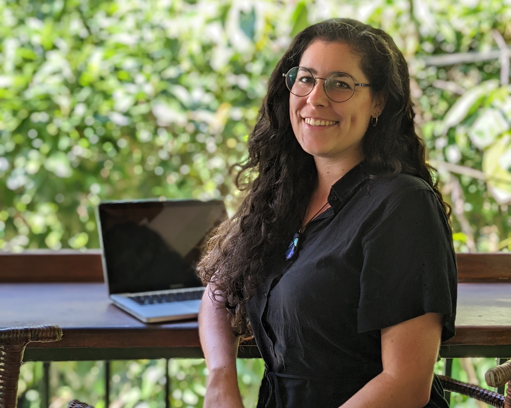

# About

Hi! I'm Esther, the driving force behind Birds of a Feather, a small travel planner, who fell in love with the country of Georgia as soon as I set foot in it.

I've been living as a digital nomad for the past three years and traveled to many countries all over the world. Georgia is one of those true hidden gems, an undiscovered destination that deserves way more love than it gets. That's why I want to help adventurous travellers experience this beautiful country.

## Custom Georgia Adventures

Because it's still so off the beaten path, there's not as much information online as there is on other, more popular, destinations. That's where I come in. Living in Georgia, I have sampled the best things to do, places to visit, and practical tips and tricks (and continue to do so!). When you [travel with me](/our-travel-services), you won't have to worry about missing anything or researching endlessly online to find practical advice on how to get to places.

## Group Trips

If you're looking for a fun and exciting trip with a group of travel friends, you're also in the right place. Next to custom adventures for small groups, we also offer [group trips](/our-travel-services/group-trips) for travellers in the age group of 21-45 years old. These trips are perfect for solo travellers who want to join a group of adventurous young people discover this amazing place. The group trips are packed full of exciting activities and you'll leave with memories and friends that'll last a lifetime.

## Helpful Links

If you've gotten excited about Georgia, please have a look around on our website, or get in touch with us! Find some helpful links for navigating our website below:

- [Read about Georgia on our blog](/blog)
- [Read more about our travel services](/our-travel-services)
- Send us a WhatsApp message if you have any questions
- Schedule a free discovery call to discuss whether Georgia is the right destination for you (no strings attached!)
- Scroll through our FAQ for answers to specific questions

