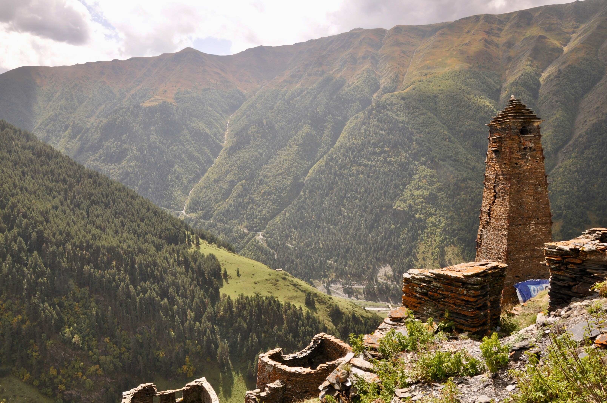
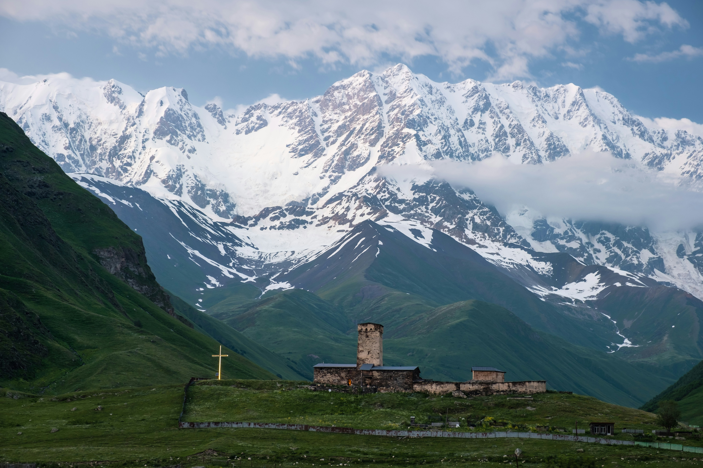
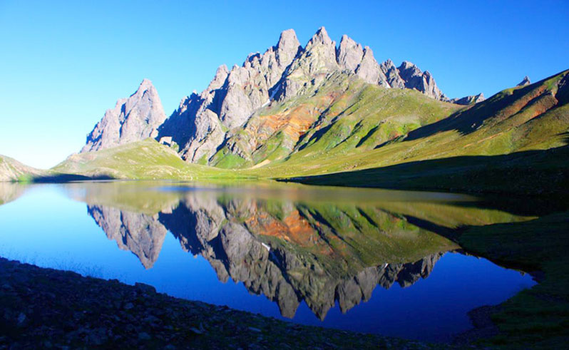

# The Best Multiple-Day Hikes in Georgia

For those with a spirit of adventure and a love for the great outdoors, Georgia is a paradise of rugged landscapes, majestic mountains, and hidden trails. With its diverse terrain, this country offers some of the most memorable multiple-day hikes that will lead you through breathtaking scenery, ancient villages, and unspoiled nature. Here’s a curated list of the best multiple-day hikes in Georgia that will satisfy your wanderlust and sense of exploration. 

<!--@include: @/affiliate-disclosure.md-->
&nbsp;

::: warning Table of Contents
[[toc]]
:::
## The Tusheti Loop

Tusheti, located in the northeast, is a region of dramatic landscapes and traditional villages. The Tusheti Loop is a challenging but rewarding hike that takes you through remote villages, high mountain passes, and lush green valleys. Starting from Omalo, the trek covers approximately 70 kilometers and usually takes about 4-5 days. Along the way, you’ll encounter shepherds’ trails, stone towers, and the unique culture of the Tush people. The hospitality of the locals and the stunning vistas make this hike a must-do.

## The Svaneti Traverse

Svaneti is a mystical region known for its towering peaks, medieval towers, and rich cultural heritage. The Svaneti Traverse is a 5-7 day hike that connects the charming village of Mestia to Ushguli, one of the highest continuously inhabited settlements in Europe. This 60-kilometer trek takes you through alpine meadows, ancient forests, and glacial rivers. Each day offers spectacular views of the Caucasus Mountains, including the imposing Mount Shkhara. The trail is dotted with traditional Svanetian towers and offers a glimpse into the unique way of life in this remote region.

## The Racha Adventure

Racha, often referred to as Georgia's Switzerland, is a region of serene beauty and untouched nature. The Racha Adventure is a 3-4 day hike that starts from the village of Shovi and takes you through the Notsara and Tbilisa mountain ranges. This trek covers about 50 kilometers and offers a mix of forested paths, alpine lakes, and panoramic mountain views. Highlights include the majestic Chiora village and the picturesque Shaori Reservoir. This hike is perfect for those looking to escape the hustle and bustle and immerse themselves in nature.

## The Kazbegi National Park Trek

Kazbegi National Park is a popular destination for its dramatic landscapes and iconic Mount Kazbek. The Kazbegi National Park Trek is a 3-day hike that starts from the village of Kazbegi (Stepantsminda) and takes you to the Gergeti Glacier. Covering approximately 40 kilometers, this trek offers stunning views of the Chaukhi Massif, the Gergeti Trinity Church, and the towering peak of Mount Kazbek. The trail passes through lush meadows, rugged terrain, and offers opportunities to see wildlife such as mountain goats and eagles.

## The Lagodekhi Protected Areas Trek

<a href="https://commons.wikimedia.org/wiki/File:%E1%B2%AF%E1%83%98%E1%83%AE%E1%83%95%E1%83%98_%E1%83%9A%E1%83%90%E1%83%92%E1%83%9D%E1%83%93%E1%83%94%E1%83%AE%E1%83%98%E1%83%A1_%E1%83%9C%E1%83%90%E1%83%99%E1%83%A0%E1%83%AB%E1%83%90%E1%83%9A%E1%83%A8%E1%83%98.jpg">Giorgimailo</a>, <a href="https://creativecommons.org/licenses/by-sa/4.0">CC BY-SA 4.0</a>, via Wikimedia Commons

Located in the eastern part of Georgia, the Lagodekhi Protected Areas offer a diverse range of flora and fauna. The Lagodekhi Trek is a 2-3 day hike that starts from the Lagodekhi Visitor Center and takes you through dense forests, pristine rivers, and alpine meadows. Covering about 30 kilometers, this trek includes highlights such as the Black Rock Lake and the stunning views from the Lagodekhi Waterfall. The rich biodiversity and the serene environment make this hike a perfect escape for nature lovers.

## The Borjomi-Kharagauli National Park Hike

Borjomi-Kharagauli National Park is one of the largest national parks in Georgia and offers a network of well-marked trails. The Borjomi-Kharagauli Hike is a 3-4 day trek that starts from the town of Borjomi and takes you through the heart of the park. Covering approximately 50 kilometers, this trek offers a variety of landscapes including dense forests, alpine meadows, and rocky outcrops. Highlights include the panoramic views from the Sametskhvario Ridge and the tranquil beauty of the Abastumani Observatory.

## The Trek to the Silver Lakes

<a href="https://commons.wikimedia.org/wiki/File:Tobavarchkhili.jpg">Superhickish</a>, <a href="https://creativecommons.org/licenses/by-sa/4.0">CC BY-SA 4.0</a>, via Wikimedia Commons

One of the hidden gems in Georgia's treasure trove of hikes is the trek to the Silver Lakes in the Samegrelo region. This 3-4 day hike is a journey into the heart of the Caucasus, where you’ll discover the serene beauty of the Tobavarchkhili Lakes, often referred to as the Silver Lakes due to their shimmering, mirror-like surfaces. The trek starts from the village of Mukhuri and winds through dense forests, alpine meadows, and rocky ascents. 

As you make your way up, you'll be rewarded with breathtaking views of the Egrisi Mountains and the crystal-clear lakes nestled among them. The final destination, Tobavarchkhili Lake, sits at an elevation of around 2,650 meters and is surrounded by towering peaks and pristine wilderness. Camping by the lakes, under a blanket of stars, is an experience that brings a profound sense of peace and connection with nature. This trek is ideal for those seeking solitude and a deeper immersion into Georgia's unspoiled landscapes.

## Chaukhi Pass: Juta to Rushka trail

Embark on the breathtaking Juta to Roshka trail, a gem among Georgia’s multiple-day hikes. Starting in the picturesque village of Juta, this trek takes you through the heart of the Caucasus Mountains, offering stunning views of jagged peaks and verdant valleys. As you ascend to the Chaukhi Pass, the panoramic vistas are simply unforgettable. Descend into the serene Roshka Valley, dotted with alpine lakes and wildflowers. This trail combines natural beauty with the thrill of adventure, making it a must for any hiking enthusiast exploring Georgia.

## Conclusion

Georgia's diverse and breathtaking landscapes make it a hiker's paradise. Each of these multiple-day hikes offers a unique experience, combining natural beauty, cultural encounters, and a sense of adventure. Whether you're traversing the high peaks of Svaneti or exploring the serene forests of Lagodekhi, these treks will leave you with unforgettable memories and a deep appreciation for Georgia's wild and wonderful terrain. So pack your gear, lace up your boots, and set off on an adventure of a lifetime!

&nbsp;

-----
&nbsp;

<!--@include: @/services-block.md-->