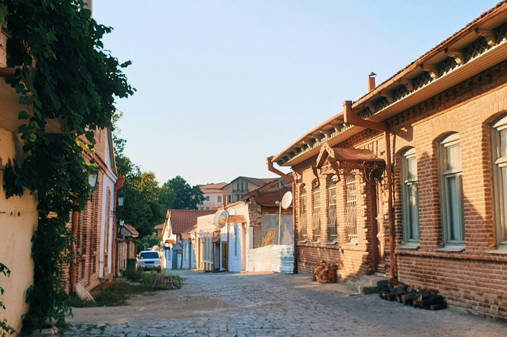
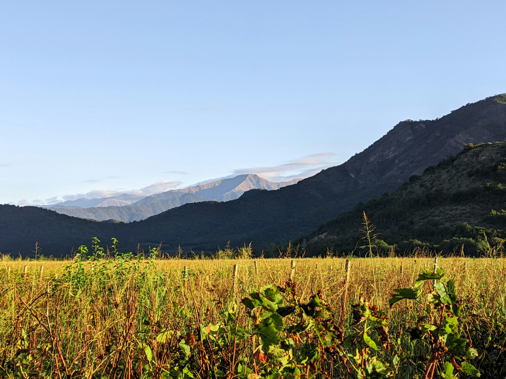
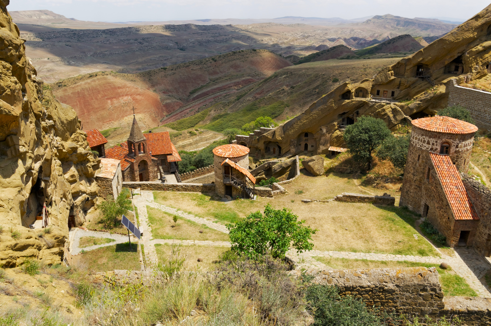
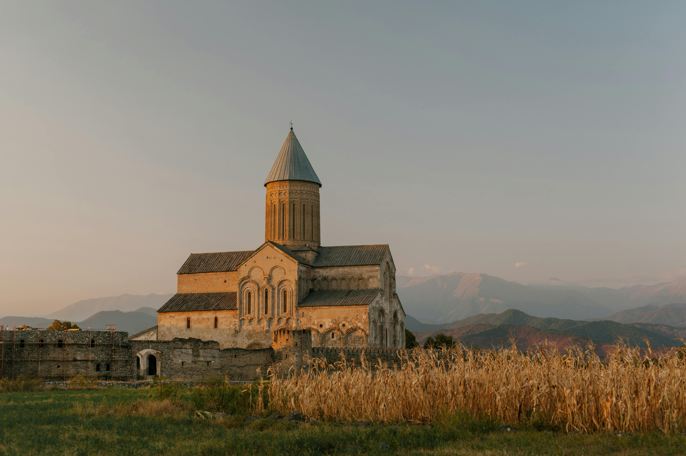
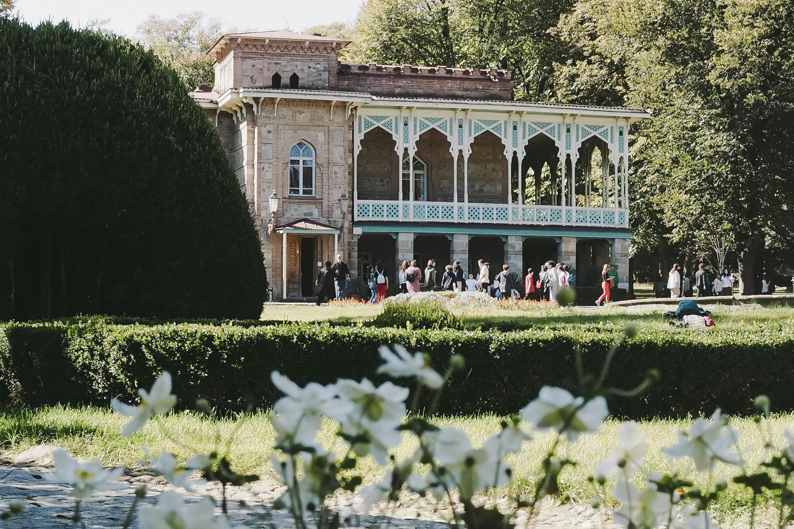

# Discover the Best of Kakheti: Georgia’s Wine Paradise

Kakheti, Georgia's premier wine region, is an unmissable destination for any traveler seeking a blend of history, culture, and natural beauty. Known as the birthplace of wine, Kakheti offers a rich tapestry of experiences that showcase its deep-rooted viticulture, stunning landscapes, and warm hospitality. Here are the top things to do in Kakheti:

::: details Table of Contents
[[toc]]
:::
## Explore Sighnaghi: The City of Love

Start your journey in the picturesque town of Sighnaghi, perched on a hilltop overlooking the Alazani Valley. Stroll through its cobbled streets, admire the charming 18th-19th century architecture, and take in panoramic views from the city walls. Visit the local art galleries, enjoy traditional Georgian cuisine in cozy restaurants, and don't miss the Bodbe Monastery, where St. Nino, the Enlightener of Georgia, is buried.

## Wine Tasting in the Alazani Valley

Kakheti is synonymous with wine, and a visit to this region wouldn't be complete without indulging in its world-renowned wine culture. The Alazani Valley is dotted with numerous wineries, from small family-run operations to large-scale producers. Tour the vineyards, learn about the ancient qvevri winemaking method, and sample a variety of local wines, including the famous Saperavi and Rkatsiteli.

## Visit the David Gareja Monastery Complex

A short drive from Sighnaghi, the David Gareja Monastery Complex offers a fascinating glimpse into Georgia's spiritual heritage. Founded in the 6th century by St. David Garejeli, this complex features rock-hewn churches, chapels, and living quarters carved into the cliffs. The area is not only a spiritual retreat but also offers stunning views of the semi-desert landscape.

<a href="https://commons.wikimedia.org/wiki/File:David_Gareja_Monastery_2,_Georgia.jpg">© Vyacheslav Argenberg / http://www.vascoplanet.com/</a>, <a href="https://creativecommons.org/licenses/by/4.0">CC BY 4.0</a>, via Wikimedia Commons

## Discover the Ancient City of Telavi

Telavi, the capital of Kakheti, is a vibrant city that blends the old with the new. Visit the Batonis Tsikhe, the 18th-century fortress that now houses a museum and a beautiful garden. Explore the local markets, where you can find fresh produce, handmade crafts, and traditional Georgian snacks. The nearby Alaverdi Monastery, dating back to the 6th century, is another must-see for its impressive architecture and historical significance.

## Experience the Tsinandali Estate

The Tsinandali Estate, once the residence of the Georgian noble family Chavchavadze, is a splendid example of Georgian aristocratic culture. The estate features a beautifully preserved house museum, a landscaped garden, and a winery. Take a guided tour to learn about the Chavchavadze family's contributions to Georgian culture and enjoy a wine tasting session in the historic cellar.

## Hike in the Lagodekhi National Park

For nature enthusiasts, the Lagodekhi National Park offers pristine wilderness and a variety of hiking trails. Explore lush forests, cascading waterfalls, and serene alpine meadows. The park is home to diverse flora and fauna, making it a perfect destination for birdwatching and wildlife spotting. The Black Rock Lake trail is particularly popular for its breathtaking views.

<a href="https://commons.wikimedia.org/wiki/File:%E1%B2%AF%E1%83%98%E1%83%AE%E1%83%95%E1%83%98_%E1%83%9A%E1%83%90%E1%83%92%E1%83%9D%E1%83%93%E1%83%94%E1%83%AE%E1%83%98%E1%83%A1_%E1%83%9C%E1%83%90%E1%83%99%E1%83%A0%E1%83%AB%E1%83%90%E1%83%9A%E1%83%A8%E1%83%98.jpg">Giorgimailo</a>, <a href="https://creativecommons.org/licenses/by-sa/4.0">CC BY-SA 4.0</a>, via Wikimedia Commons

&nbsp;

-----
&nbsp;

<!--@include: @/services-block.md-->