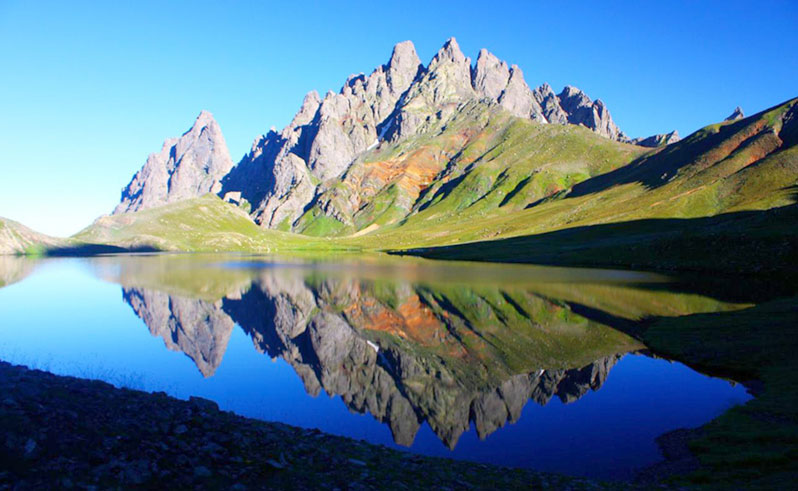
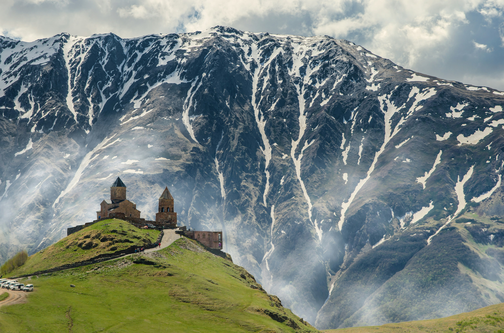
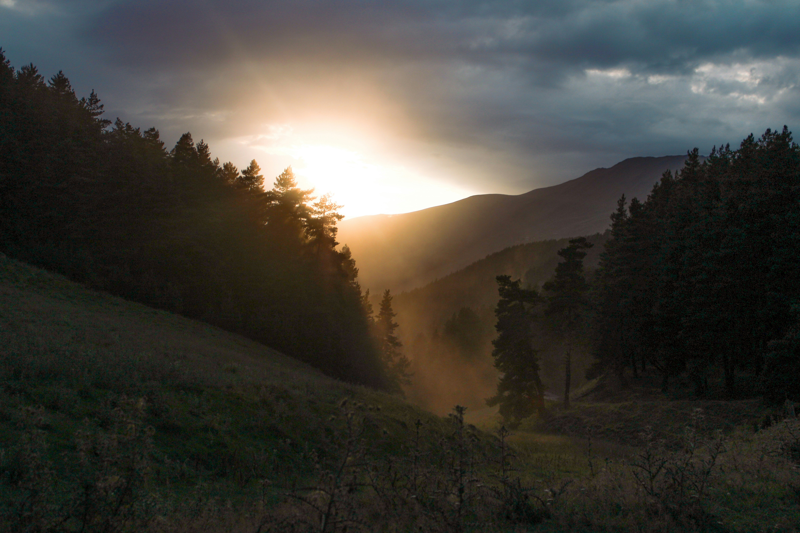

# Best Things to Do for Nature Lovers in the Country of Georgia

Welcome to Georgia, where nature’s grandeur is on full display, offering an array of experiences for every type of outdoor enthusiast. Whether you’re into hiking rugged mountains, exploring lush forests, or simply soaking in breathtaking landscapes, Georgia has something to captivate your adventurous spirit. Here’s a curated list of the best things to do for nature lovers in this stunning country.

&nbsp;

::: warning Table of Contents
[[toc]]
:::
## Hike in the Caucasus Mountains

The Caucasus Mountains are the crown jewel of Georgia’s natural beauty. With peaks soaring over 5,000 meters, these mountains offer some of the most spectacular hiking trails in the world. Head to **Svaneti**, a remote region known for its well-preserved medieval villages and dramatic mountain scenery. Trekking routes such as the **Mestia to Ushguli** trail provide a perfect blend of challenging paths and rewarding views.

## Explore Borjomi-Kharagauli National Park

Borjomi-Kharagauli National Park is one of the largest national parks in Europe, and it’s a haven for nature enthusiasts. The park boasts a diverse range of flora and fauna, and its well-marked trails make it accessible for hikers of all levels. Don’t miss the panoramic views from the **Lomismta** and **Likani** trails, which offer stunning vistas of the surrounding landscapes.

## Discover the Martvili Canyon

Martvili Canyon, located in the Samegrelo region, is a hidden gem that offers a unique way to experience Georgia’s natural beauty. The canyon’s emerald-green waters and cascading waterfalls create a serene environment perfect for kayaking and boat tours. As you navigate through the narrow gorges, you’ll be mesmerized by the striking rock formations and vibrant greenery.

## Samegrelo and Tobavarchkhili Lake

In the enchanting region of Samegrelo, nature lovers will find the hidden gem of Tobavarchkhili Lake, often referred to as the "Silver Lake" due to its pristine and reflective waters. This remote and stunning lake is nestled high in the mountains, surrounded by dense forests and breathtaking alpine meadows. The journey to Tobavarchkhili Lake is an adventure in itself, involving a multiple-day hike through landscapes unique to this part of Georgia. This destination offers an unparalleled experience for those seeking tranquility, natural beauty, and a touch of wilderness.

<a href="https://commons.wikimedia.org/wiki/File:Tobavarchkhili.jpg">Superhickish</a>, <a href="https://creativecommons.org/licenses/by-sa/4.0">CC BY-SA 4.0</a>, via Wikimedia Commons
## Venture into the Vashlovani National Park

Vashlovani National Park, situated in the southeastern part of Georgia, is a stark contrast to the country’s mountainous regions. Known for its semi-desert landscapes and unique rock formations, this park offers a different kind of adventure. The **Alazani Floodplain**, with its diverse wildlife, and the stunning **Takhti-Tepa** hills are highlights you won’t want to miss. It’s an ideal spot for hiking, wildlife photography, and experiencing the raw beauty of Georgia’s varied terrain.

## Walk Among the Giants in Lagodekhi Protected Areas

Lagodekhi Protected Areas, located on the border with Azerbaijan, are renowned for their ancient forests and rich biodiversity. The reserve is home to over 150 species of birds and numerous mammals, making it a paradise for wildlife enthusiasts. Trails such as the **Gurgeniani Waterfall** and **Ninoskhevi Waterfall** offer scenic routes through dense forests and along pristine rivers, leading to stunning cascades.

<a href="https://commons.wikimedia.org/wiki/File:Ninoskhevi_waterfall_8.jpg">Paata vardanashvili</a>, <a href="https://creativecommons.org/licenses/by-sa/4.0">CC BY-SA 4.0</a>, via Wikimedia Commons

## Immerse Yourself in Kazbegi National Park

Kazbegi National Park, dominated by the majestic Mount Kazbek, is a haven for mountaineers and nature lovers alike. The park offers a range of activities from hiking and horseback riding to more extreme adventures like mountaineering. The hike to the **Gergeti Trinity Church**, perched high above the town of Stepantsminda, provides one of the most iconic views in Georgia, with the towering Kazbek peak in the background.

## Admire the Beauty of Tusheti

Tusheti, located in the northeastern part of Georgia, is a remote region that offers some of the most pristine landscapes in the country. The area is known for its traditional stone towers, alpine meadows, and dramatic mountain scenery. The drive to Tusheti, via the Abano Pass, is an adventure in itself, but once you arrive, the trekking opportunities and cultural experiences are unparalleled.

Georgia’s natural landscapes are as diverse as they are breathtaking. Whether you’re a seasoned adventurer or someone who simply appreciates the beauty of the great outdoors, this country has something to offer. From towering mountains and serene lakes to lush forests and unique canyons, Georgia is a paradise for nature lovers. Pack your bags, lace up your hiking boots, and get ready to explore the wild beauty of this incredible destination.

&nbsp;

-----
&nbsp;

<!--@include: @/services-block.md-->