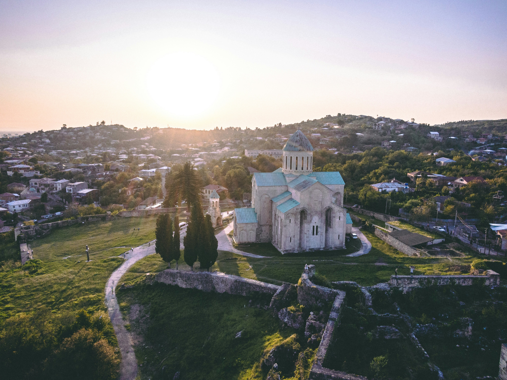
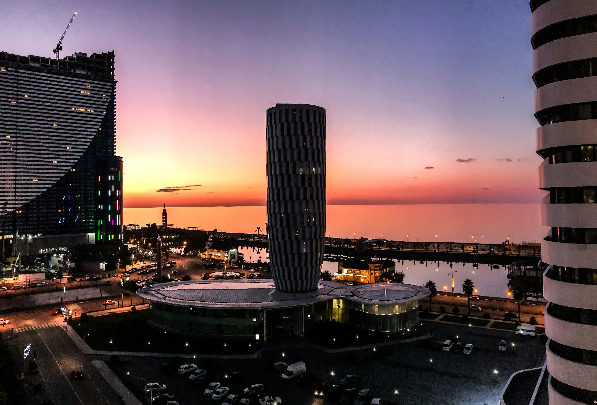
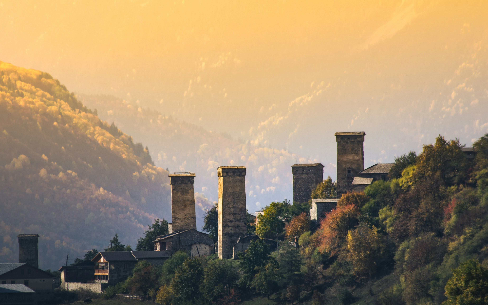
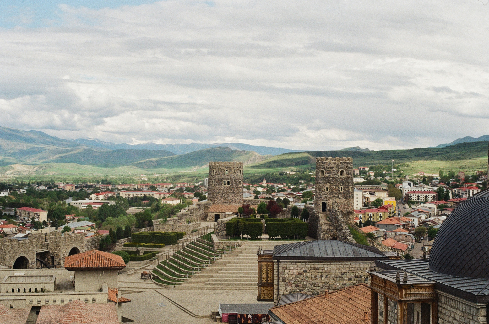

# Beyond Tbilisi: Exploring Georgia's Other Cities and Towns

While Tbilisi often steals the spotlight as Georgia’s vibrant capital, the country is dotted with other fascinating cities each offering their own unique charm and experiences. From historic landmarks and cultural treasures to natural beauty and local cuisine, these cities provide a deeper understanding of Georgia’s rich heritage. Let’s embark on a journey to discover the must-visit cities in Georgia beyond Tbilisi.

::: details Table of Contents
[[toc]]
:::
## Kutaisi: A Gateway to History and Nature

Kutaisi, Georgia's second-largest city, is a treasure trove of history and culture. Once the capital of ancient Colchis, Kutaisi is steeped in myth and legend, famously known for the Golden Fleece sought by Jason and the Argonauts.

- **Bagrati Cathedral:** This 11th-century cathedral, a UNESCO World Heritage site, stands as a testament to Georgia’s medieval architecture and offers panoramic views of the city.
- **Gelati Monastery:** Another UNESCO-listed site, Gelati is a masterpiece of the Georgian Golden Age, founded by King David IV in the 12th century. The monastery complex is adorned with stunning frescoes and mosaics.
- **Prometheus Cave:** Just a short drive from Kutaisi, this natural wonder boasts spectacular stalactites, stalagmites, and underground rivers. Guided tours reveal the cave’s mesmerizing beauty.
- **Sataplia Nature Reserve:** Home to dinosaur footprints and a scenic glass walkway, Sataplia combines natural beauty with prehistoric intrigue.

## Batumi: The Pearl of the Black Sea

Batumi, a coastal city on the Black Sea, is Georgia’s prime seaside resort known for its blend of modern architecture and historic charm. Its subtropical climate and vibrant atmosphere make it a year-round destination.

- **Batumi Boulevard:** This long seaside promenade is perfect for a leisurely stroll or bike ride, lined with cafes, sculptures, and gardens.
- **Batumi Botanical Garden:** Spanning over 100 hectares, the garden is a lush paradise with diverse plant species from around the world. The panoramic views of the Black Sea are simply breathtaking.
- **Piazza Square:** Inspired by Italian piazzas, this lively square is surrounded by colorful buildings, cafes, and live music venues, creating a vibrant social hub.
- **Batumi Dolphinarium:** A popular attraction for families, the dolphinarium offers entertaining shows and the chance to swim with dolphins.

## Mestia: The Heart of Svaneti

Nestled in the Caucasus Mountains, Mestia is the cultural and administrative center of the Svaneti region, renowned for its rugged beauty and ancient traditions. This highland town is a gateway to some of Georgia’s most stunning landscapes.

- **Svan Towers:** These medieval stone towers, unique to Svaneti, served as defensive structures and family dwellings. They offer a glimpse into the region’s feudal past.
- **Museum of History and Ethnography:** This museum houses a rich collection of artifacts, including ancient manuscripts, weapons, and traditional Svanetian items.
- **Hiking and Mountaineering:** Mestia is a paradise for outdoor enthusiasts, offering numerous trekking routes and climbing opportunities, including trails to the Ushguli community, one of Europe’s highest inhabited villages.
- **Winter Sports:** In winter, Mestia transforms into a ski destination with resorts like Hatsvali and Tetnuldi providing excellent slopes for skiing and snowboarding.

## Telavi: The Heart of Kakheti Wine Region

Telavi, the principal city of the Kakheti region, is the heart of Georgia’s wine country. Surrounded by vineyards and historic sites, Telavi offers a perfect blend of viticulture and cultural exploration.

- **Tsinandali Estate:** Once the residence of the noble Chavchavadze family, this estate is now a museum and winery. The beautiful gardens and wine cellar tours are highlights.
- **Alaverdi Monastery:** Founded in the 6th century, this ancient monastery is one of the oldest and tallest in Georgia, surrounded by vineyards and producing its own wine.
- **Batonis Tsikhe:** This well-preserved fortress complex was the residence of the Kakhetian kings. The museum within offers insights into the region’s history.
- **Wine Tasting Tours:** Telavi and its surroundings are dotted with wineries offering tours and tastings, allowing visitors to sample the unique qvevri wines.

## Akhaltsikhe: A Fortress of History

Akhaltsikhe, located in the southwest of Georgia, is a city with a rich multicultural heritage. Its name means “New Castle,” and the city’s star attraction is indeed its imposing fortress.

- **Rabati Castle:** This recently renovated fortress complex is a blend of various architectural styles reflecting the city’s diverse history. Inside, you’ll find a mosque, a church, a synagogue, and a museum.
- **Vardzia Cave Monastery:** A short drive from Akhaltsikhe, this remarkable cave city and monastery complex was carved into the cliffs during the 12th century by Queen Tamar.
- **Borjomi-Kharagauli National Park:** One of the largest national parks in Georgia, it offers numerous hiking trails, hot springs, and stunning views of the Lesser Caucasus Mountains.

## Conclusion

Georgia’s cities beyond Tbilisi offer a rich tapestry of experiences that highlight the country’s diverse history, culture, and natural beauty. From the ancient cathedrals of Kutaisi to the seaside charm of Batumi, the rugged mountains of Mestia, the vineyards of Telavi, and the historical forts of Akhaltsikhe, each city has its own unique story to tell. As you plan your journey through Georgia, make sure to include these hidden gems for an unforgettable adventure.

&nbsp;

-----
&nbsp;

<!--@include: @/services-block.md-->