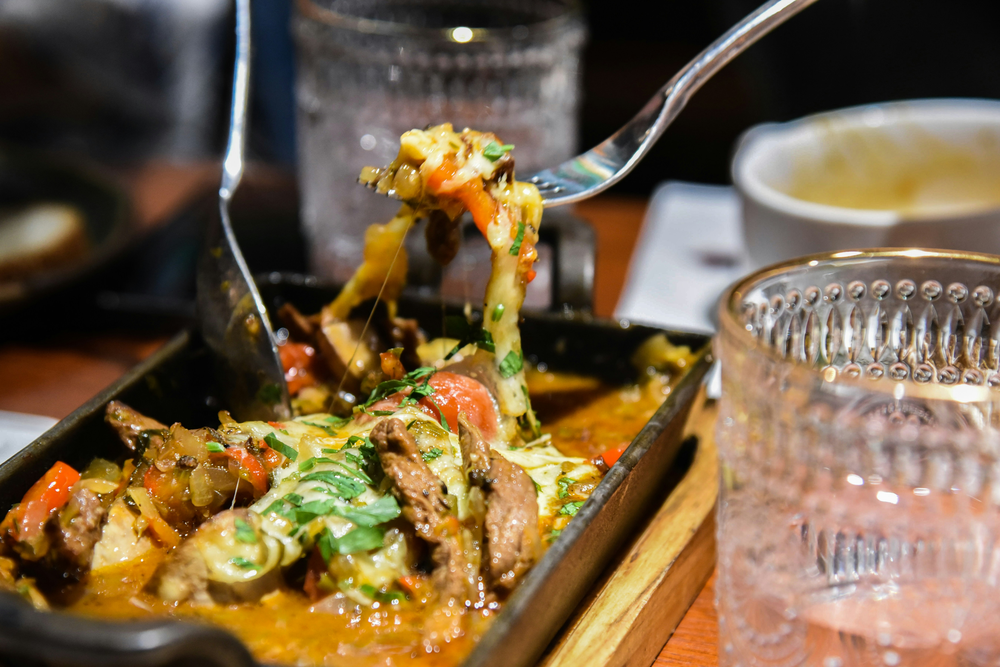
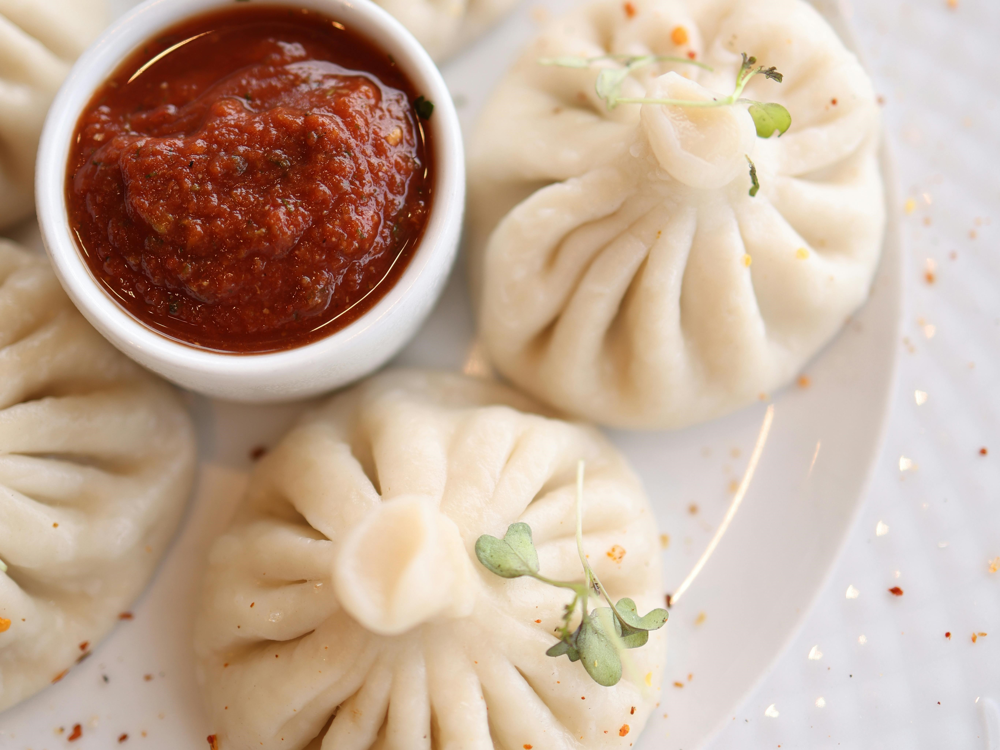
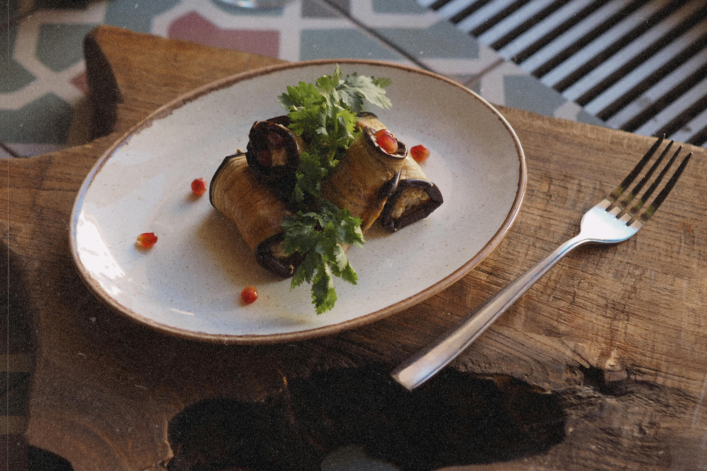
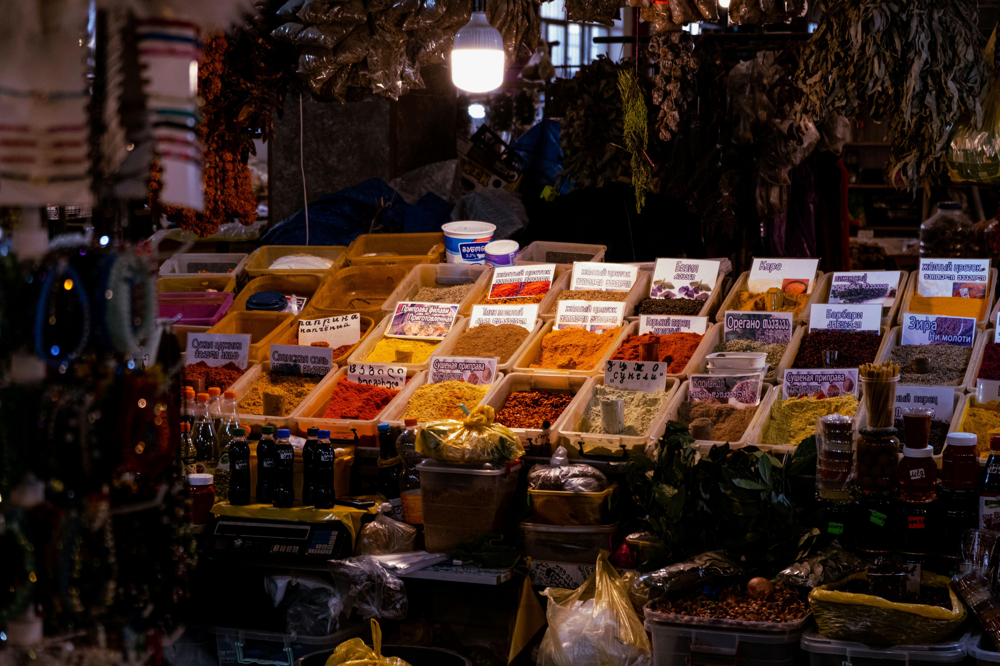
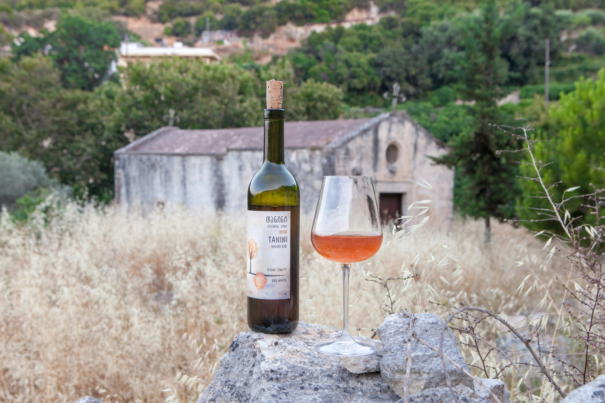

# Exploring Georgia's Culinary Traditions: A Feast for the Senses

Georgia, a country nestled between the Caucasus Mountains and the Black Sea, offers a culinary heritage as rich and diverse as its landscape. With influences from Europe, the Middle East, and Central Asia, Georgian cuisine is a delightful fusion of flavors, techniques, and traditions that have been passed down through generations. In this in-depth exploration, we will delve into Georgia's culinary traditions, iconic dishes, and the cultural significance of food in Georgian society.

::: warning Table of Contents
[[toc]]
:::
## The Heart of Georgian Cuisine: Supra

At the core of Georgian culinary tradition is the "supra," a traditional feast that showcases the country's deep-seated hospitality and love for communal dining. The supra is more than just a meal; it is a celebration of life, family, and friendship, presided over by a "tamada" (toastmaster) who leads the guests through a series of toasts, each with its own significance and story.

## Bread and Cheese: The Staples

Bread and cheese are staples of the Georgian diet, each with its unique variations and cultural importance.

- **Puri (Bread):** Georgian bread is often baked in a "tone," a traditional clay oven. The most iconic variety is "shotis puri," an elongated bread with a crispy crust and soft interior. The process of baking puri is an art form, with bakers skillfully shaping the dough and sticking it to the inner walls of the oven.
- **Sulguni (Cheese):** A semi-soft, brined cheese, sulguni is a staple in Georgian households. Known for its elasticity and slightly tangy flavor, sulguni is often used in various dishes, including the famous "khachapuri."

## Khachapuri: The Quintessential Georgian Dish

No exploration of Georgian cuisine is complete without mentioning khachapuri, the beloved cheese-filled bread that comes in numerous regional variations.

- **Adjaruli Khachapuri:** Perhaps the most famous, this boat-shaped bread is filled with sulguni cheese and topped with a raw egg and a pat of butter. The yolk is mixed into the cheese, creating a rich and creamy filling that is perfect for dipping the bread.
- **Imeruli Khachapuri:** A simpler, round version filled with a mixture of sulguni and imeruli cheese, this variation is commonly found throughout the country.
- **Megruli Khachapuri:** Similar to Imeruli but with an extra layer of cheese on top, Megruli khachapuri offers an additional burst of cheesy goodness.

## Traditional Georgian Dishes: A Symphony of Flavors

Georgian cuisine is known for its vibrant and aromatic dishes that reflect the country’s rich agricultural heritage and the diverse influences of its neighbors.

- **Khinkali:** These iconic Georgian dumplings are a must-try. Typically filled with spiced meat, such as beef or pork, khinkali are juicy and flavorful. The dough is carefully folded into pleats, creating a pocket that traps the delicious broth inside. To eat khinkali, hold the top knot, take a small bite to sip the broth, and then enjoy the rest.
- **Lobio:** A hearty bean stew that comes in various forms, lobio is a staple in Georgian cuisine. The dish is often flavored with garlic, coriander, and walnuts, and served with mchadi (cornbread) or pickled vegetables.
- **Badrijani Nigvzit:** Eggplant slices rolled around a savory filling of walnut paste, garlic, and spices. This dish is a testament to the Georgian love for walnuts and their ability to elevate simple ingredients into something extraordinary.
- **Chakhokhbili:** A traditional chicken stew cooked with tomatoes, onions, and a blend of aromatic herbs and spices. This dish showcases the harmonious blend of flavors that is characteristic of Georgian cuisine.

## Herbs, Spices, and Sauces: The Flavor Enhancers

Georgian cuisine is renowned for its use of fresh herbs, spices, and sauces that add depth and complexity to every dish.

- **Khmeli Suneli:** A traditional Georgian spice blend that includes blue fenugreek, coriander, marigold, and other aromatic spices. Khmeli suneli is used to season a variety of dishes, from stews to grilled meats.
- **Adjika:** A spicy, aromatic paste made from red peppers, garlic, and herbs. Adjika adds a fiery kick to many Georgian dishes and is often used as a condiment or marinade.
- **Tkemali:** A tangy plum sauce made from green or red plums, tkemali is a popular accompaniment to grilled meats and potatoes. Its unique flavor comes from the combination of sour plums, garlic, and fresh herbs like dill and cilantro.

## Georgian Wine: The Perfect Pairing

Wine plays a central role in Georgian culinary traditions, with the country being one of the oldest wine-producing regions in the world. The ancient qvevri method of winemaking, using large clay vessels buried underground, is still practiced today and produces some of the most unique and natural wines available.

- **Saperavi:** A dark-skinned grape variety that produces rich, full-bodied red wines with flavors of dark berries and spices. Saperavi wines are perfect for pairing with hearty meat dishes.
- **Rkatsiteli:** A versatile white grape variety that produces aromatic white and amber wines. Rkatsiteli wines are known for their crisp acidity and notes of green apple and citrus, making them an excellent match for lighter dishes and salads.

## The Sweet Finale: Georgian Desserts

Georgian desserts are a delightful end to any meal, showcasing the country's love for nuts, honey, and fruits.

- **Churchkhela:** Often referred to as "Georgian snickers," churchkhela is made by dipping strings of nuts (usually walnuts or hazelnuts) into a thickened grape juice mixture called tatara. Once dried, these chewy, sweet treats are perfect for a quick snack or dessert.
- **Pelamushi:** A traditional dessert made from grape must, pelamushi is a thick pudding-like treat that is often garnished with walnuts or dried fruits.

## Conclusion

Georgia's culinary traditions offer a rich tapestry of flavors, history, and cultural significance. From the communal joy of the supra to the unique techniques of bread baking and winemaking, Georgian cuisine invites you to explore its depths and savor every bite. Whether you're a seasoned food enthusiast or a curious traveler, Georgia's culinary landscape promises an unforgettable journey through the heart and soul of this remarkable country. So, come and experience the flavors of Georgia – a feast for the senses that will leave you longing for more.

&nbsp;

-----
&nbsp;

<!--@include: @/services-block.md-->