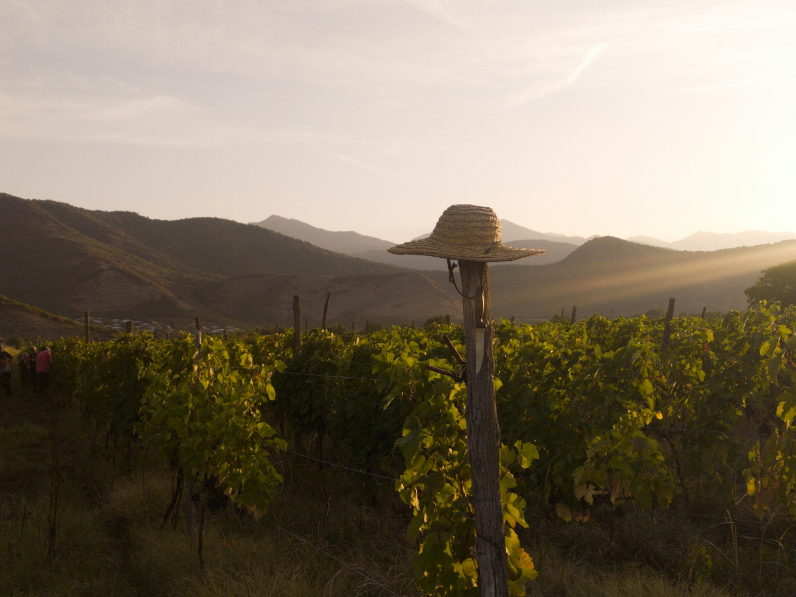
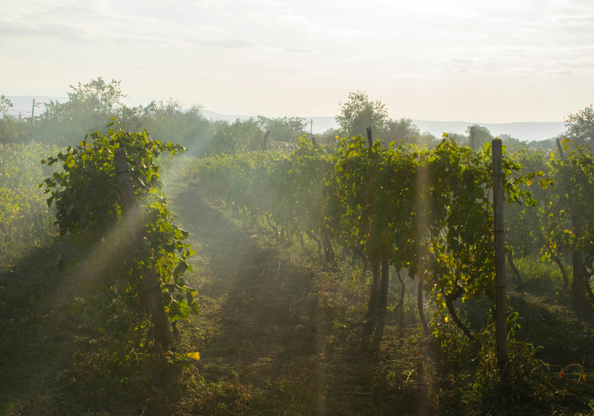

# Exploring Georgia’s Wine Heritage: Regions, History, and Grape Varieties

Georgia, nestled at the crossroads of Europe and Asia, is a country with a winemaking tradition that spans over 8,000 years. Often referred to as the "Cradle of Wine," Georgia boasts an unparalleled wine heritage deeply interwoven with its culture and history. In this article, we'll delve into Georgia's rich wine regions, the fascinating history of its winemaking, and the unique grape varieties that make Georgian wine a treasure trove for enthusiasts and connoisseurs alike.

::: warning Table of Contents
[[toc]]
:::
## The Birthplace of Wine: A Historical Journey

Georgia's winemaking history is one of the oldest in the world, dating back to the Neolithic period. Archaeological discoveries have uncovered qvevri (large clay vessels used for fermentation and storage) that date back to 6000 BCE, making Georgia the birthplace of winemaking. The ancient method of fermenting grapes in qvevri, buried underground, is still practiced today and has been recognized by UNESCO as an intangible cultural heritage.

Wine has always been more than just a beverage in Georgia; it’s a symbol of hospitality, tradition, and identity. From ancient times, wine has played a central role in Georgian rituals, feasts (supra), and daily life. The traditional Georgian feast, led by a toastmaster (tamada), is an experience that showcases the deep respect and love Georgians have for their wine.

## Discovering Georgia’s Wine Regions

Georgia is home to several distinct wine regions, each offering unique terroirs and grape varieties. Let's explore some of the most prominent wine regions that contribute to the country's diverse wine landscape.

### Kakheti: The Heart of Georgian Winemaking

Kakheti, located in eastern Georgia, is the most famous and productive wine region, often considered the heart of Georgian winemaking. This region accounts for approximately 70% of the country’s wine production.

- **Tsinandali:** Known for its elegant white wines, Tsinandali produces wines from the Rkatsiteli and Mtsvane grape varieties, characterized by their crisp acidity and floral aromas.
- **Mukuzani:** Renowned for its robust red wines made from Saperavi grapes, Mukuzani wines are aged in oak, giving them rich flavors of dark berries and spices.
- **Kvareli:** This sub-region is famous for its semi-sweet red wines, particularly those made from Saperavi grapes, offering a delightful balance of sweetness and tannins.

### Kartli: The Historic Winemaking Region

Situated in central Georgia, Kartli is a region with a rich winemaking history dating back to ancient times. The region is known for both its red and white wines, produced using traditional and modern methods.

- **Ateni:** Ateni Valley is famous for its microclimate, which produces unique wines from grape varieties like Chinuri, Goruli Mtsvane, and Tavkveri.
- **Gori:** This area is known for its sparkling wines, made primarily from Chinuri grapes, offering a refreshing and crisp profile.

### Imereti: The Land of Versatile Wines

Imereti, in western Georgia, is known for its diverse range of wines and the unique winemaking technique of fermenting wines in qvevri with less skin contact.

- **Tsolikouri:** A prominent white grape variety in Imereti, Tsolikouri wines are known for their bright acidity and fruity aromas.
- **Otskhanuri Sapere:** This red grape variety produces wines with deep color and rich, berry flavors, often with a hint of spiciness.

### Racha-Lechkhumi: The Boutique Wine Region

Racha-Lechkhumi, a small region in northwestern Georgia, is renowned for its high-quality semi-sweet wines made from rare grape varieties.

- **Khvanchkara:** Perhaps the most famous wine from this region, Khvanchkara is a semi-sweet red wine made from Aleksandrouli and Mujuretuli grapes, known for its complex flavors of ripe red fruits and balanced sweetness.
- **Tvishi:** This area is known for its semi-sweet white wines made from the Tsolikouri grape, offering a delicate sweetness with notes of tropical fruits and honey.

## Unique Georgian Grape Varieties

Georgia is home to over 500 indigenous grape varieties, many of which are not found anywhere else in the world. Here are some of the most notable ones:

- **Saperavi:** A dark-skinned grape variety, Saperavi is the backbone of Georgian red wines. It’s known for its deep color, high acidity, and ability to age well. Saperavi wines are rich in flavors of dark berries, plums, and spices.
- **Rkatsiteli:** One of the most widely planted grape varieties in Georgia, Rkatsiteli produces aromatic white wines with notes of green apple, pear, and citrus. It’s also used in the production of amber wines.
- **Mtsvane:** Often blended with Rkatsiteli, Mtsvane adds floral and fruity notes to the wines. It’s known for its crisp acidity and refreshing character.
- **Aleksandrouli:** A red grape variety primarily grown in Racha-Lechkhumi, Aleksandrouli is used to make the famous Khvanchkara wine. It’s known for its intense aromas of red fruits and balanced sweetness.
- **Tsolikouri:** Predominantly grown in Imereti, Tsolikouri produces versatile white wines ranging from dry to semi-sweet. The wines are characterized by their bright acidity and fruity profile.

## Conclusion

Georgia’s wine heritage is a captivating journey through history, culture, and tradition. From the ancient qvevri winemaking method to the diverse wine regions and unique grape varieties, Georgia offers a wine experience like no other. Whether you’re a seasoned wine enthusiast or a curious traveler, exploring Georgia’s wine country promises an unforgettable adventure filled with rich flavors, warm hospitality, and timeless traditions. So, raise a glass and toast to the cradle of wine – a destination that beckons with its storied past and vibrant present.

&nbsp;

-----
&nbsp;

<!--@include: @/services-block.md-->