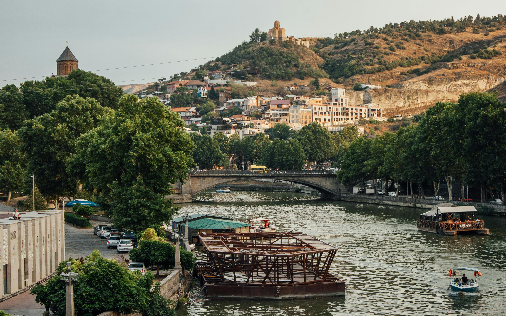
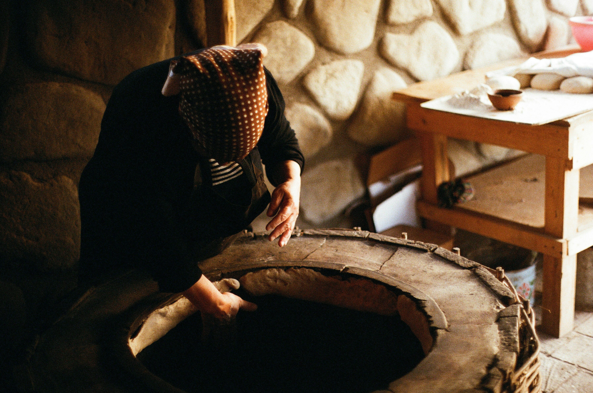
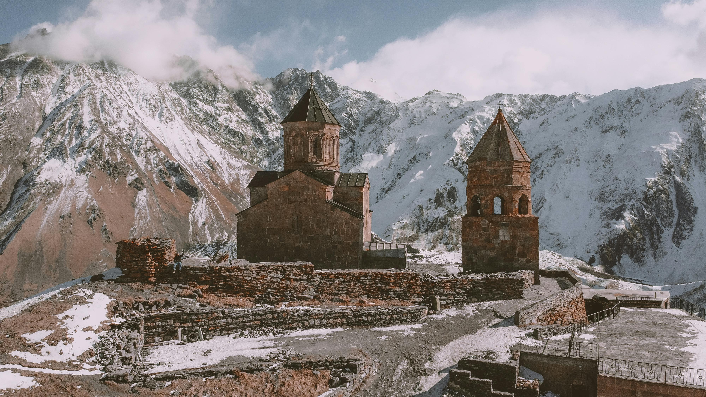
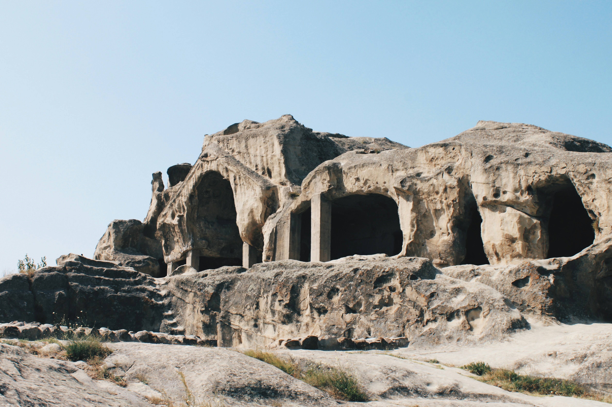
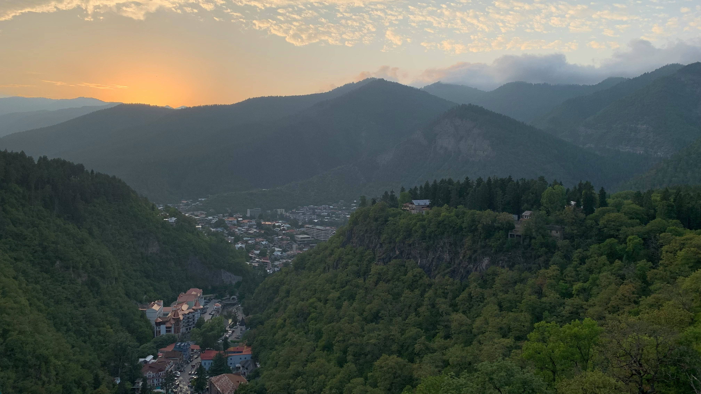

# One-Week Adventure Through Georgia: A Perfect Itinerary

Georgia, a gem nestled in the heart of the Caucasus, offers a rich blend of history, culture, and natural beauty. If you have one week to explore this enchanting country, here’s a thoughtfully curated itinerary that captures the essence of Georgia. From bustling cities and ancient monasteries to stunning mountain landscapes and charming wine regions, this trip has it all.

::: warning Table of Contents
[[toc]]
:::
## Day 1: Arrival in Tbilisi

Your journey begins in Tbilisi, Georgia’s vibrant capital. After settling into your hotel, take a leisurely stroll through the historic Old Town. Wander the narrow, cobblestone streets, visit the ancient sulfur baths, and marvel at the eclectic mix of architecture. Don't miss the stunning views from the Narikala Fortress, accessible by a scenic cable car ride. In the evening, dine at one of the many local restaurants and indulge in traditional Georgian dishes like khinkali (dumplings) and khachapuri (cheese bread).

## Day 2: Exploring Tbilisi

Dedicate your second day to exploring more of Tbilisi. Start with a visit to the Georgian National Museum to understand the country's rich history. Next, walk along Rustaveli Avenue, Tbilisi's main thoroughfare, lined with theaters, museums, and shops. Head to the Dry Bridge Market for unique souvenirs and antiques. End your day with a relaxing boat ride on the Mtkvari River, offering a different perspective of the city's beauty.

## Day 3: Day Trip to Mtskheta

On the third day, take a short drive to Mtskheta, the ancient capital of Georgia and a UNESCO World Heritage site. Visit the Svetitskhoveli Cathedral, one of the most sacred places in Georgia, and the Jvari Monastery, which offers panoramic views of the town where the Aragvi and Mtkvari rivers meet. Return to Tbilisi in the evening and explore the nightlife or enjoy a quiet dinner.

## Day 4: Kakheti Wine Region

Depart Tbilisi early for a day trip to Kakheti, Georgia's premier wine region. Your first stop is the picturesque town of Sighnaghi, known as the “City of Love.” Wander through its charming streets, visit the local museum, and enjoy the breathtaking views of the Alazani Valley. Then, head to a local winery to taste some of Georgia’s famous wines and learn about the traditional winemaking process, which dates back 8,000 years. Return to Tbilisi with a bottle or two of your favorite Georgian wine.

## Day 5: Kazbegi and the Caucasus Mountains

Leave Tbilisi for the breathtaking Caucasus Mountains. Your destination is Stepantsminda (formerly Kazbegi), a picturesque town at the foot of Mount Kazbek. En route, stop at the Ananuri Fortress and the Jinvali Reservoir. Upon arrival, hike or take a 4x4 vehicle to the Gergeti Trinity Church, perched high above the town with stunning views of Mount Kazbek. Spend the night in Stepantsminda, enjoying the crisp mountain air and the serene landscape.

## Day 6: Discovering Uplistsikhe and Gori

On your sixth day, head south to explore Uplistsikhe, an ancient rock-hewn town dating back to the early Iron Age. Wander through its caves, tunnels, and ancient structures, imagining life as it was thousands of years ago. Continue to Gori, the birthplace of Joseph Stalin, where you can visit the Stalin Museum and learn about his controversial legacy. Return to Tbilisi for your final night in the capital.

## Day 7: Borjomi and Vardzia

For your final day, venture to Borjomi, famous for its mineral water. Stroll through the Borjomi Central Park and taste the renowned spring water. Then, drive to the Vardzia cave monastery, a remarkable rock-cut complex from the 12th century. Explore its hidden tunnels, chapels, and living quarters carved into the cliffs. Return to Tbilisi in the evening, capping off your week-long adventure with a farewell dinner at a traditional Georgian restaurant.

## Practical Tips for Your Journey

When traveling in Georgia, it’s essential to be prepared for a mix of climates, especially if you’re exploring both urban areas and mountainous regions. Layered clothing, sturdy footwear, and a good travel guide are recommended. Georgian hospitality is legendary, so be ready to make new friends and enjoy generous meals. Public transportation is available, but hiring a private driver or renting a car offers more flexibility and comfort for your adventure.

In just one week, you’ll experience the diverse beauty and rich culture of Georgia. This itinerary offers a perfect blend of city life, historical exploration, and natural wonders, ensuring that you leave with unforgettable memories and a deep appreciation for this remarkable country.

&nbsp;

-----
&nbsp;

<!--@include: @/services-block.md-->