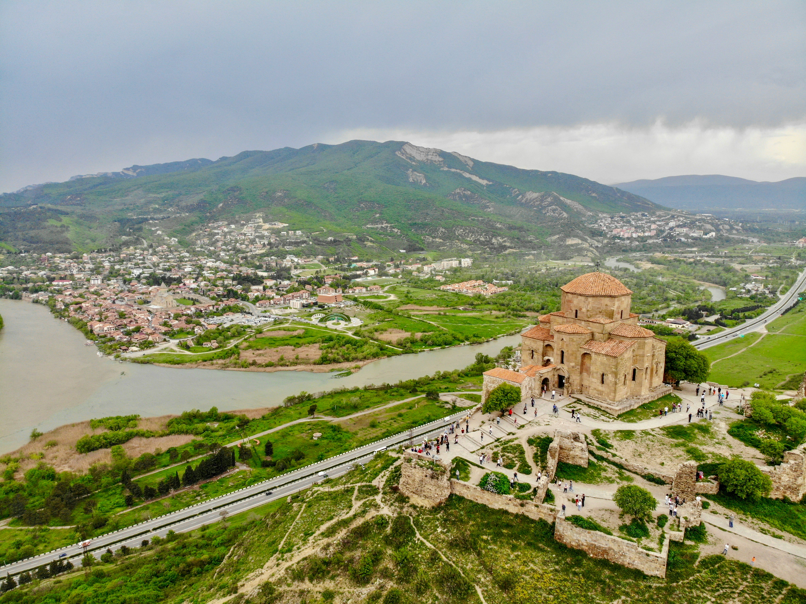

# Best Day Trips from Tbilisi

While Tbilisi has plenty to offer, there are many wonderful places just a short drive away that are perfect for day trips. Here are some of the best day trips from Tbilisi.

::: details Table of Contents
[[toc]]
:::
## Mtskheta

Mtskheta is one of Georgia’s oldest cities and a UNESCO World Heritage site. It’s just a 30-minute drive from Tbilisi and is home to important religious sites, including the Jvari Monastery and Svetitskhoveli Cathedral. It’s a must-visit for history and culture enthusiasts.

## Kazbegi (Stepantsminda)

Located about three hours from Tbilisi, Kazbegi is known for its stunning mountain scenery. The highlight is the Gergeti Trinity Church, perched on a hilltop with breathtaking views of Mount Kazbek. The area also offers great opportunities for hiking and exploring nature.

## Kakheti Wine Region

Kakheti is Georgia’s premier wine region, just a couple of hours from Tbilisi. You can visit wineries, taste local wines, and learn about Georgia’s ancient winemaking traditions. The town of Sighnaghi, known as the “City of Love,” is a charming place to explore in Kakheti.

## Uplistsikhe

Uplistsikhe is an ancient rock-hewn town about an hour and a half from Tbilisi. This fascinating site dates back to the early Iron Age and offers a unique glimpse into Georgia’s past. The complex includes tunnels, caves, and ancient dwellings carved into the rock.

## David Gareja Monastery

David Gareja is a cave monastery complex located about two hours from Tbilisi, near the border with Azerbaijan. The complex dates back to the 6th century and is known for its impressive frescoes and stunning landscapes. It’s a unique and spiritual place to visit.

<a href="https://commons.wikimedia.org/wiki/File:David_Gareja_Monastery_2,_Georgia.jpg">© Vyacheslav Argenberg / http://www.vascoplanet.com/</a>, <a href="https://creativecommons.org/licenses/by/4.0">CC BY 4.0</a>, via Wikimedia Commons
## Final Thoughts

These day trips offer a chance to explore the diverse landscapes and rich history of Georgia beyond Tbilisi. Whether you’re interested in ancient cities, mountain adventures, or wine tasting, there’s a perfect day trip waiting for you.

&nbsp;

-----
&nbsp;

<!--@include: @/services-block.md-->