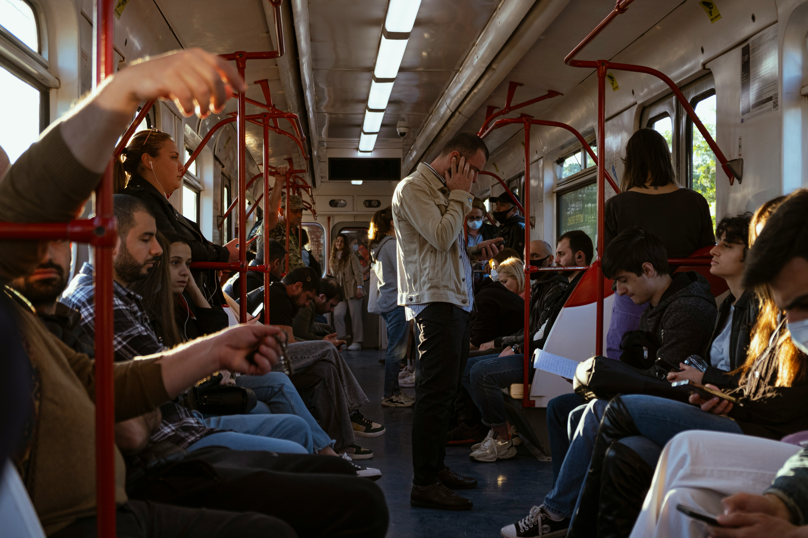

# Everything You Need To Know Before Visiting Tbilisi

If you're planning a trip to Tbilisi, the vibrant capital of Georgia, there are a few things you should know to make the most of your visit. From cultural etiquette to practical travel tips, here’s what you need to know before you go.

::: warning Table of Contents
[[toc]]
:::
## Best Time to Visit Tbilisi

The best time to visit Tbilisi is during the spring (April to June) and autumn (September to November) when the weather is pleasant, and the city is at its most beautiful. Summers can be quite hot, while winters are relatively mild but can be rainy.

## Getting Around the City

**Public Transport:** Tbilisi has an efficient public transport system, including buses, minibusses (marshrutkas), and a metro. The metro is particularly convenient, with signs in English and easy-to-use tokens.

**Taxis and Ride-Sharing:** Taxis are plentiful and affordable, but make sure to agree on a fare before starting your journey or use a ride-sharing app like Bolt for a hassle-free experience.

**Walking:** Many of Tbilisi’s attractions are within walking distance, especially in the Old Town. Walking is a great way to explore the city's charming streets and discover hidden gems.

## Currency and Payments

The currency in Georgia is the Georgian Lari (GEL). Credit cards are widely accepted in hotels, restaurants, and shops, but it's a good idea to carry some cash, especially when visiting local markets or smaller establishments.

## Language

The official language is Georgian, which has its own unique alphabet. While English is not widely spoken among older generations, many young people and those working in the tourism industry speak English. Learning a few basic Georgian phrases can be helpful and appreciated by locals.

## Safety

Tbilisi is generally a safe city, with a low crime rate. However, as with any travel destination, it’s wise to stay vigilant, especially in crowded areas and tourist spots. Keep an eye on your belongings and avoid walking alone late at night.

## Cultural Etiquette

- **Dress Modestly:** While Tbilisi is quite modern and cosmopolitan, it’s respectful to dress modestly, especially when visiting religious sites. Women should consider carrying a scarf to cover their heads when entering churches.
- **Hospitality:** Georgians are known for their hospitality. If you’re invited to someone’s home, it’s polite to bring a small gift, such as sweets or flowers.
- **Table Etiquette:** When dining, wait for the host to make the first toast. It’s also customary to try a bit of everything offered to you, as refusing food can be seen as impolite.

## Must-Try Foods and Drinks

- **Khachapuri:** A cheese-filled bread that's a staple of Georgian cuisine.
- **Khinkali:** Georgian dumplings typically filled with meat, herbs, and spices.
- **Pkhali:** A variety of vegetable pâtés made from spinach, beets, or beans.
- **Churchkhela:** A traditional Georgian sweet made from grape must, nuts, and flour.
- **Georgian Wine:** Georgia is one of the oldest wine-producing regions in the world. Be sure to try local varieties like Saperavi (red) and Rkatsiteli (white).

## Electricity and Internet

Georgia uses Type C and Type F power plugs with a standard voltage of 220V. Free Wi-Fi is widely available in hotels, cafes, and restaurants, making it easy to stay connected.

## Health and Travel Insurance

It’s advisable to have travel insurance that covers health care in case of any emergencies. While Tbilisi has good medical facilities, having insurance can provide peace of mind.

## Final Thoughts

Tbilisi is a city that seamlessly blends history and modernity, offering a unique travel experience. By keeping these tips in mind, you'll be well-prepared to enjoy everything this fascinating city has to offer. Safe travels!

&nbsp;

-----
&nbsp;

<!--@include: @/services-block.md-->