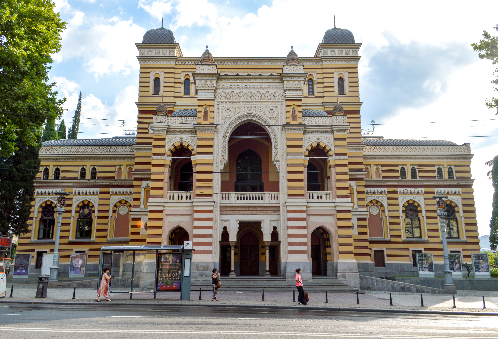

# Exploring Tbilisi's Vibrant Art and Culture Scene

Tbilisi is a cultural melting pot, offering a diverse range of venues and events that celebrate its rich heritage and artistic spirit. Here’s your guide to exploring Tbilisi’s vibrant art and culture scene.

::: warning Table of Contents
[[toc]]
:::
## What are the main cultural venues in Tbilisi?

Tbilisi boasts several prominent cultural venues that showcase its artistic and historical treasures:

- **Georgian National Museum**: A comprehensive collection of artifacts spanning Georgia’s history.
- **Tbilisi Opera and Ballet Theatre**: A cultural landmark hosting world-class opera and ballet performances throughout the year.
- **MOMA Tbilisi**: Museum of Modern Art showcasing contemporary Georgian and international art.
- **Fabrika**: A former Soviet sewing factory transformed into a cultural hub with art galleries, workshops, and exhibitions.
- **Art Gene Festival**: An annual festival celebrating Georgian folk culture through music, dance, and art.

<a href="https://commons.wikimedia.org/wiki/File:National_Opera_House._Tbilisi,_Georgia.jpg">Francisco Anzola</a>, <a href="https://creativecommons.org/licenses/by/2.0">CC BY 2.0</a>, via Wikimedia Commons

## Are there any notable art galleries or museums?

Explore Tbilisi’s art scene at these notable galleries and museums:

- **National Gallery**: Located within the Georgian National Museum, featuring Georgian and European art collections.
- **Galleria Tbilisi**: A modern shopping mall with a range of art galleries showcasing local and international artists.
- **Tbilisi History Museum**: Offers insights into the city’s past through interactive exhibits and displays.

<a href="https://commons.wikimedia.org/wiki/File:National_Gallery,_Rustaveli_Avenue,_Tbilisi,_Georgia.jpg">JohnDodelande_Georgie</a>, CC0, via Wikimedia Commons

## What cultural events should I look out for?

Immerse yourself in Tbilisi’s cultural calendar with these must-attend events:

- **Tbilisi International Film Festival**: Showcases a diverse selection of international and Georgian films.
- **Tbilisi Jazz Festival**: Brings together jazz enthusiasts and musicians from around the world.
- **Tbilisi Art Fair**: A platform for contemporary art, featuring exhibitions, talks, and performances.
- **Tbilisi Fashion Week**: Highlights Georgian fashion designers and trends.
- **Tbilisoba**: Annual festival celebrating the city’s history, culture, and cuisine with street performances and traditional crafts.

<a href="https://commons.wikimedia.org/wiki/File:Tbilisi_at_night,_Fireworks_2,_Holiday,_Georgia.jpg">© Vyacheslav Argenberg / http://www.vascoplanet.com/</a>, <a href="https://creativecommons.org/licenses/by/4.0">CC BY 4.0</a>, via Wikimedia Commons

&nbsp;

-----
&nbsp;

<!--@include: @/services-block.md-->