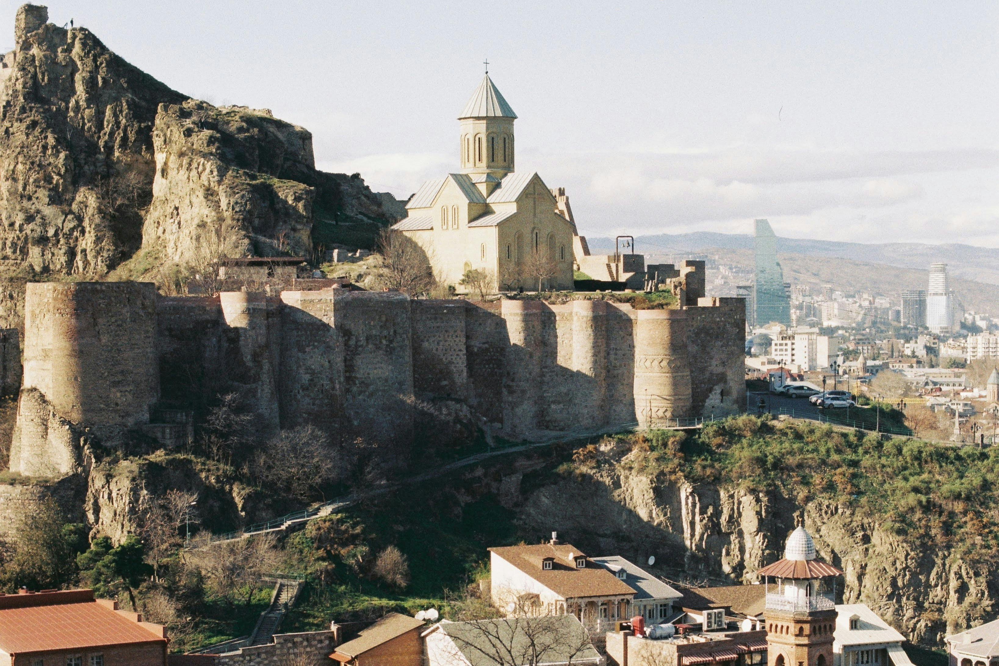
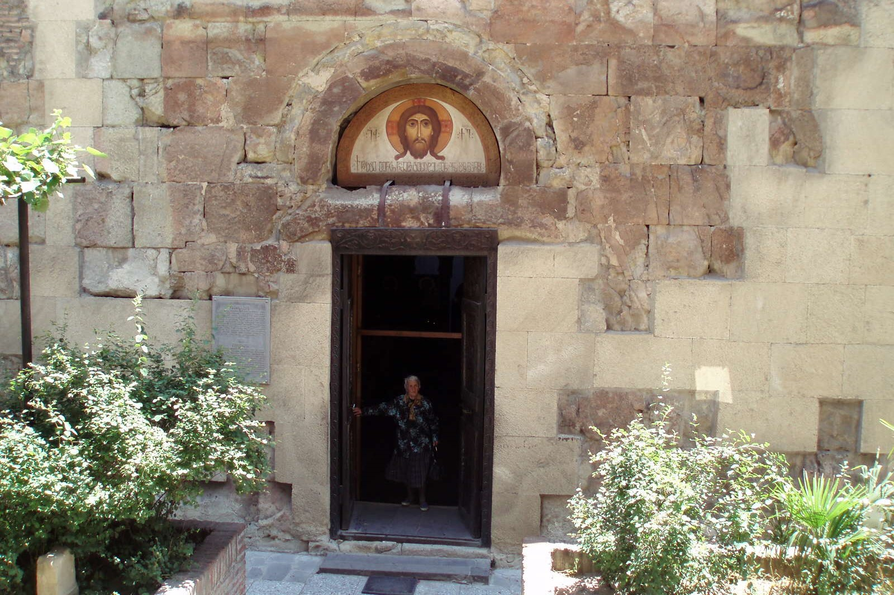

# Must-Visit Historical Sites in Tbilisi

Tbilisi is a city steeped in history, with many ancient sites that tell the story of its past. Here are some must-visit historical sites that you shouldn’t miss.

::: details Table of Contents
[[toc]]
:::
## Narikala Fortress

Narikala Fortress is one of the most iconic landmarks in Tbilisi. Dating back to the 4th century, this ancient fortress offers stunning panoramic views of the city. The fortress has witnessed many historical events and stands as a testament to Tbilisi’s resilience.

## Anchiskhati Basilica

Anchiskhati Basilica is the oldest surviving church in Tbilisi, built in the 6th century. This charming basilica is known for its beautiful frescoes and serene atmosphere, offering a glimpse into the early Christian architecture of Georgia.

<a href="https://commons.wikimedia.org/wiki/File:Anchiskhati_church,_Tbilisi.jpg">DAVID HOLT from London, England</a>, <a href="https://creativecommons.org/licenses/by-sa/2.0">CC BY-SA 2.0</a>, via Wikimedia Commons
## Sioni Cathedral

Located in the heart of the Old Town, Sioni Cathedral dates back to the 6th century, with several reconstructions over the centuries. The cathedral is home to important religious artifacts, including a cross believed to have been made by St. Nino, who brought Christianity to Georgia.

<a href="https://commons.wikimedia.org/wiki/File:Sioni_Cathedral_Tbilisi.jpg">Parastoo.Atrsaei</a>, <a href="https://creativecommons.org/licenses/by-sa/4.0">CC BY-SA 4.0</a>, via Wikimedia Commons
## Jvari Monastery

A short drive from Tbilisi, Jvari Monastery is a UNESCO World Heritage site that dates back to the 6th century. Perched on a hilltop, it offers breathtaking views of the confluence of the Mtkvari and Aragvi rivers. The monastery is a fine example of early Georgian church architecture.

## Metekhi Church and Statue of King Vakhtang Gorgasali

Overlooking the Mtkvari River, the Metekhi Church is an iconic symbol of Tbilisi. Built in the 13th century, it stands on the site of King Vakhtang Gorgasali’s palace. The nearby statue of King Vakhtang, the founder of Tbilisi, adds to the historical significance of the location.

<a href="https://commons.wikimedia.org/wiki/File:Iglesia_de_Metekhi,_Tiflis,_Georgia,_2016-09-29,_DD_142-144_HDR.jpg">Diego Delso</a>, <a href="https://creativecommons.org/licenses/by-sa/4.0">CC BY-SA 4.0</a>, via Wikimedia Commons
## Final Thoughts

Exploring Tbilisi’s historical sites is like taking a journey through time. Each site has its own story, offering insights into the city’s rich cultural heritage. Whether you’re a history enthusiast or simply curious about the past, these sites are sure to leave a lasting impression.

&nbsp;

-----
&nbsp;

<!--@include: @/services-block.md-->