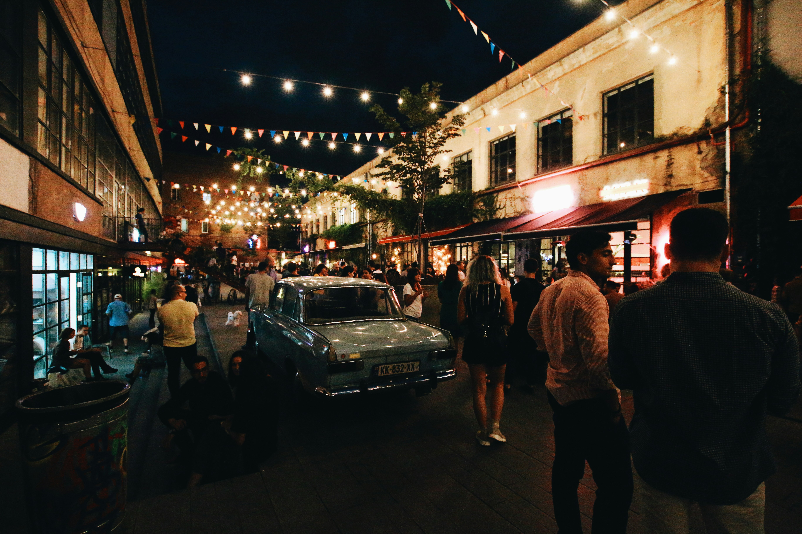
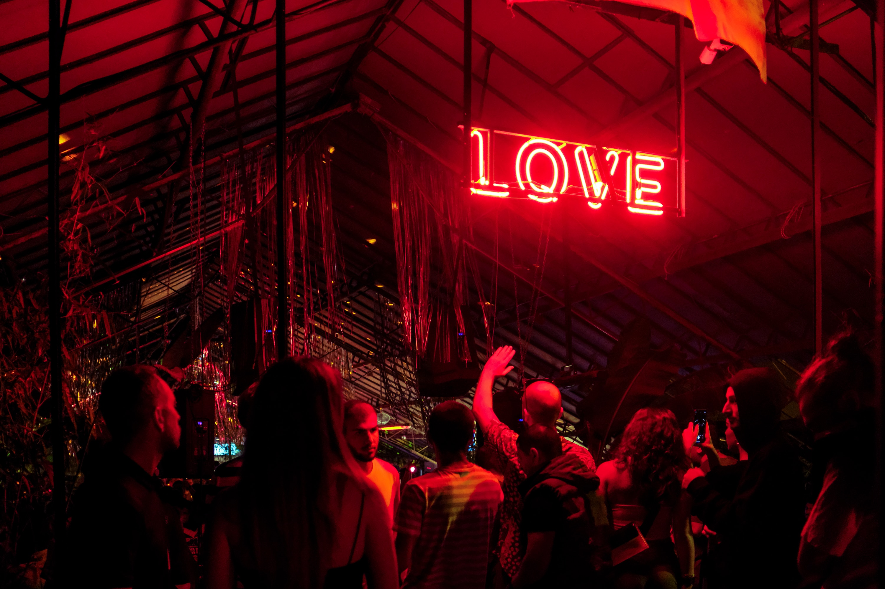

# Nightlife in Tbilisi: Bars, Clubs, and Live Music Venues

Tbilisi's nightlife is as vibrant and diverse as the city itself. From trendy bars and underground clubs to live music venues, there's something for every night owl in this dynamic city.

::: details Table of Contents
[[toc]]
:::
## Bars

Tbilisi boasts a variety of bars where you can start your evening with a cocktail or a glass of Georgian wine. Dive Bar, located in the heart of the city, is a popular spot with a laid-back atmosphere and a great selection of drinks. Lolita, set in a beautiful historic building, offers a more upscale experience with its stylish decor and creative cocktails. For a taste of Poland in Tbilisi, head to Warszawa Bar, known for its Polish vodka and friendly vibe.
### Best Bars

- **Dive Bar**: Known for its laid-back atmosphere and craft cocktails, perfect for starting your evening.
- **Lolita**: A trendy spot offering a mix of Georgian and international cuisine, live music, and a lively bar scene.
- **Warszawa Bar**: A unique venue with a cozy interior, delicious drinks, and regular live performances.

## Clubs

When it comes to clubbing, Tbilisi is famous for its cutting-edge electronic music scene. Bassiani, located in the basement of the Dinamo Arena, is one of the city's most renowned clubs. Known for its high-quality sound system and impressive line-up of international DJs, Bassiani offers an unforgettable night out. Khidi, another top club, is situated in an old Soviet-era factory and features a mix of techno, house, and experimental music. Mtkvarze, located along the river, combines great music with stunning views, making it a favorite among locals and visitors alike.
### Unique Clubs

- **Bassiani**: Located in a former swimming pool, Bassiani is a renowned techno club attracting both locals and international visitors.
- **Khidi**: An underground club known for its electronic music scene and artistic ambiance.
- **Mtkvarze**: Offers a diverse range of music genres and a spacious outdoor area for enjoying warm evenings.

## Live Music

If live music is more your style, Tbilisi has plenty of venues to choose from. Tbilisi Jazz Club is a haven for jazz enthusiasts, hosting regular performances by local and international artists. Backstage76 is another great spot for live music, offering a cozy atmosphere and a diverse line-up of genres. For a taste of Georgian folk music, visit Amra, where you can enjoy traditional songs and dances in an intimate setting.

### Live Music Venues

- **Tbilisi Jazz Club**: A must-visit for jazz enthusiasts, hosting live performances by local and international artists.
- **Backstage76**: Known for its intimate setting and acoustic sessions, ideal for discovering emerging talents.
- **Amra**: Offers a cozy atmosphere, live music, and a wide selection of drinks, making it a favorite among locals and tourists alike.

## Unique Experiences

Tbilisi's nightlife also includes some unique experiences that you won't find anywhere else. Fabrika, a former Soviet sewing factory turned multi-functional space, is a hub for creatives and night owls. Here, you can enjoy a drink at one of the many bars, listen to live music, or simply soak in the eclectic atmosphere.

Whether you're in the mood for a quiet drink, a night of dancing, or a live music performance, Tbilisi's nightlife scene has something to offer. The city's diverse venues and vibrant energy make it an exciting place to explore after dark.

&nbsp;

-----
&nbsp;

<!--@include: @/services-block.md-->