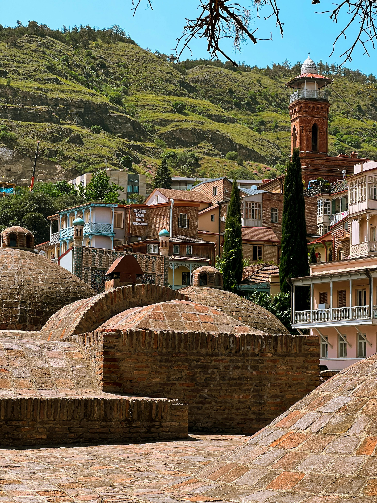

# A Perfect Day in Tbilisi: Your Guide to Exploring the City in 24 Hours

While you could easily spend weeks and months and years in Tbilisi without ever getting bored, it is possible to get a feel for the city and see its main highlights in just one day. From its rich history to its modern attractions,  the vibrant capital of Georgia offers a unique blend of old and new that can be experienced in just one day. Here’s a guide to make the most out of your 24 hours in Tbilisi.

::: warning Table of Contents
[[toc]]
:::
## Early Morning: Start with a Traditional Georgian Breakfast

### Café Littera
Begin your day at Café Littera, located in a beautiful garden setting within the Writer’s House. This spot offers a serene atmosphere and a delicious Georgian breakfast. Try the traditional khachapuri (cheese-filled bread) and matsoni (a type of Georgian yogurt) to fuel your day.

<a href="https://commons.wikimedia.org/wiki/File:Writer%27s_House_of_Georgia.jpg">Hundnase</a>, <a href="https://creativecommons.org/licenses/by-sa/4.0">CC BY-SA 4.0</a>, via Wikimedia Commons
## Mid-Morning: Explore the Old Town

### Narikala Fortress
After breakfast, head to the Narikala Fortress for a dose of history and panoramic views. The fortress dates back to the 4th century and offers stunning vistas of the city. You can either hike up or take the cable car from Rike Park for a more leisurely ascent.

### Abanotubani
Next, explore the Abanotubani district, famous for its sulphur baths. The baths have been a staple of Tbilisi’s culture for centuries. Even if you don't have time for a soak, the area is worth a visit for its unique architecture and historical significance.

## Lunch: Taste Georgian Cuisine

### Shavi Lomi
For lunch, visit Shavi Lomi, a cozy restaurant that serves traditional Georgian dishes with a modern twist. Don't miss trying khinkali (dumplings) and pkhali (a variety of vegetable pâtés). The restaurant’s ambiance is charming and offers a relaxing break in your day.

## Afternoon: Museums and Modern Tbilisi

### Georgian National Museum
Spend your afternoon at the Georgian National Museum, where you can learn about the country’s rich history and culture. The museum houses impressive collections of artifacts, including ancient gold jewelry and medieval manuscripts.

<a href="https://commons.wikimedia.org/wiki/File:Georgian_National_Museum_15043_(9067066727).jpg">Panegyrics of Granovetter from Toronto, Ontario, Canada</a>, <a href="https://creativecommons.org/licenses/by-sa/2.0">CC BY-SA 2.0</a>, via Wikimedia Commons

### Fabrika
Next, head to Fabrika, a former Soviet sewing factory turned into a multi-functional urban space. Here, you’ll find cafes, bars, shops, and artist studios. It’s a great place to relax, enjoy a coffee, and soak in the creative atmosphere.

## Early Evening: Stroll Through Rustaveli Avenue

### Rustaveli Avenue
Take a leisurely stroll down Rustaveli Avenue, Tbilisi’s main thoroughfare. The street is lined with impressive buildings, including the Georgian National Opera Theater and the Parliament of Georgia. It’s a great place to experience the hustle and bustle of the city.

<a href="https://commons.wikimedia.org/wiki/File:National_Gallery,_Rustaveli_Avenue,_Tbilisi,_Georgia.jpg">JohnDodelande_Georgie</a>, CC0, via Wikimedia Commons

## Dinner: Savor Georgian Wine and Cuisine

### Wine Factory No. 1
End your day with dinner at Wine Factory No. 1, a historic winery complex that now hosts a range of restaurants and bars. Enjoy a tasting of Georgian wines, which are renowned for their unique flavors and ancient winemaking traditions. Pair your wine with a selection of local dishes to complete your culinary experience.

## Night: Experience Tbilisi’s Nightlife

### Bassiani
If you still have energy left, Tbilisi’s nightlife is not to be missed. Head to Bassiani, one of the city’s most famous nightclubs, located in the basement of the Dinamo Arena. Known for its cutting-edge electronic music and vibrant atmosphere, it’s the perfect place to dance the night away.

## Final Thoughts

Tbilisi is a city that beautifully balances its historical roots with a modern, vibrant culture. Whether you’re a history buff, a foodie, or someone who enjoys exploring urban spaces, Tbilisi has something for everyone. In just 24 hours, you can experience a rich tapestry of sights, sounds, and flavors that will leave you eager to return for more.

&nbsp;

-----
&nbsp;

<!--@include: @/services-block.md-->