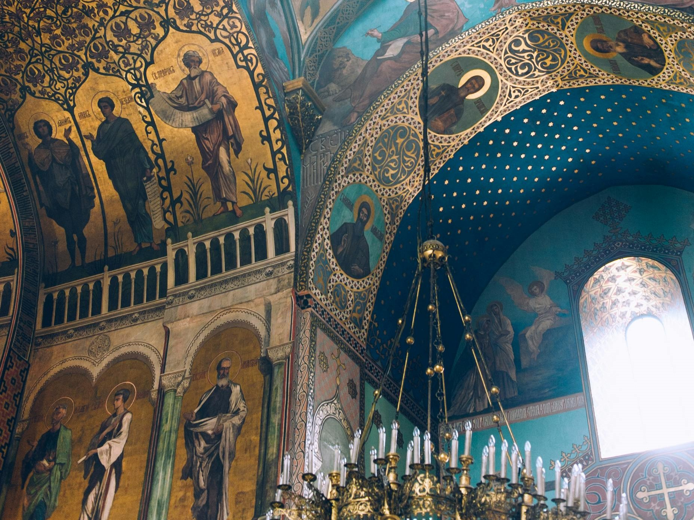
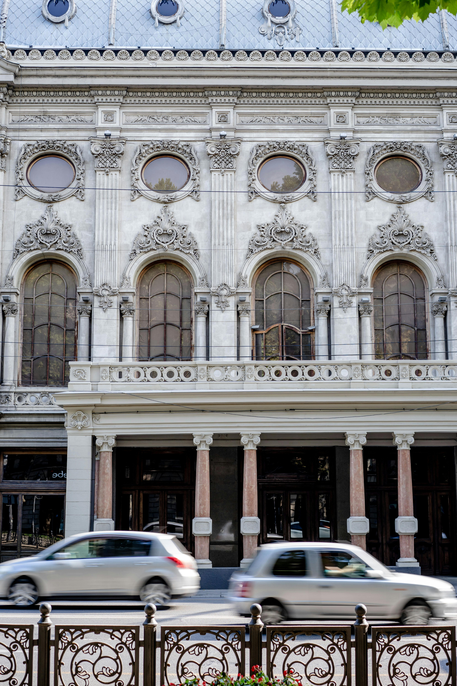
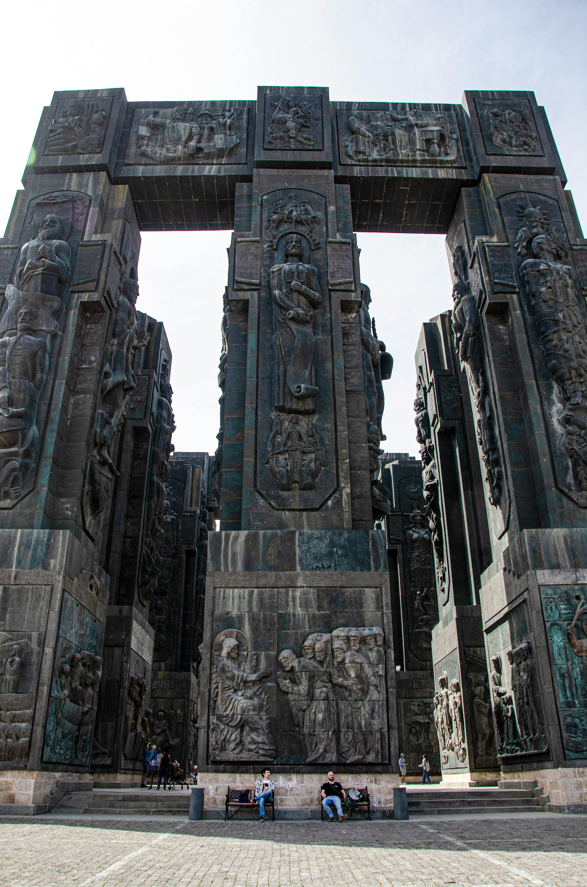
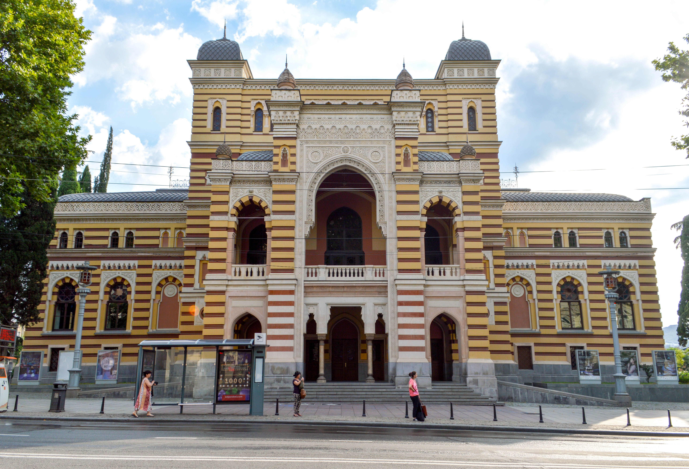

# Discover Tbilisi in Three Days: A Comprehensive Itinerary

Tbilisi, the enchanting capital of Georgia, is a city where ancient history meets modern vibrancy. With its unique blend of cultural influences, diverse cuisine, and stunning architecture, Tbilisi is a destination that promises to captivate every traveler. Here's a detailed three-day itinerary to help you make the most of your visit to this beautiful city.

::: details Table of Contents
[[toc]]
:::
## Day 1: Delve into Tbilisi’s Historical Heart

### Morning: Discover the Old Town

**9:00 AM - Breakfast at Stamba Café**

Start your day with a delicious breakfast at Stamba Café. Located in a repurposed Soviet-era printing house, this trendy spot offers a diverse menu with options ranging from traditional Georgian dishes to international favorites. The chic ambiance and excellent coffee will set the tone for your day.

**10:00 AM - Explore the Old Town (Kala)**

After breakfast, head to Tbilisi’s Old Town, known as Kala. Begin your exploration at **Freedom Square**, home to the impressive statue of St. George. Wander through the narrow, cobblestone streets, discovering charming courtyards and colorful houses with wooden balconies.

**11:00 AM - Visit Anchiskhati Basilica**

Next, visit the Anchiskhati Basilica, the oldest surviving church in Tbilisi, dating back to the 6th century. The basilica’s modest exterior belies its historical significance, and the serene interior offers a moment of tranquility.

**12:00 PM - Sioni Cathedral**

Continue your journey to Sioni Cathedral, an architectural gem with beautiful frescoes and a rich history. The cathedral is dedicated to the Assumption of the Virgin Mary and has been an important religious site since the 6th century.

### Afternoon: Culture and Cuisine

**1:00 PM - Lunch at Samikitno**

For lunch, head to Samikitno, a popular restaurant offering a wide array of traditional Georgian dishes. Try khachapuri (cheese-filled bread), khinkali (dumplings), and a refreshing glass of homemade lemonade. The lively atmosphere and delicious food make it a great spot to refuel.

**2:30 PM - Narikala Fortress and Botanical Garden**

After lunch, take the cable car from Rike Park to Narikala Fortress. The fortress, dating back to the 4th century, provides stunning panoramic views of Tbilisi. Spend some time exploring the ruins and taking in the breathtaking vistas of the city below.

From the fortress, it’s a short walk to the Tbilisi Botanical Garden. Wander through the lush gardens, enjoy the peaceful atmosphere, and perhaps take a rest by the waterfall. The garden is a perfect spot to relax and escape the hustle and bustle of the city.

**4:30 PM - Sulphur Baths in Abanotubani**

No visit to Tbilisi is complete without experiencing the famous sulphur baths in the Abanotubani district. Opt for a private room at Chreli-Abano, where you can soak in the healing waters and enjoy a traditional scrub. The baths are both rejuvenating and a unique cultural experience.

### Evening: Food and Entertainment

**7:00 PM - Dinner at Shavi Lomi**

For dinner, make your way to Shavi Lomi, a stylish restaurant known for its contemporary take on Georgian cuisine. The menu features creative dishes made with fresh, local ingredients, and the cozy interior creates a welcoming atmosphere.

**9:00 PM - Nightcap at Fabrika**

End your day with a drink at Fabrika, a former Soviet sewing factory turned multi-functional space. Fabrika’s courtyard is a lively hub with bars, cafes, and art studios. Enjoy a cocktail or local craft beer while soaking in the eclectic vibe and mingling with locals and fellow travelers.

## Day 2: Art, Markets, and Modern Tbilisi

### Morning: Art and History

**9:00 AM - Breakfast at Entree**

Start your second day with a delicious breakfast at Entree, a popular bakery and café. Enjoy freshly baked pastries, sandwiches, and excellent coffee as you prepare for another day of exploration.

**10:00 AM - Tbilisi History Museum**

Head to the Tbilisi History Museum, located in the heart of the Old Town. The museum, housed in an old caravanserai, offers fascinating exhibits that trace the city’s history from ancient times to the present. The collection includes archaeological artifacts, photographs, and artworks, providing a comprehensive overview of Tbilisi’s rich past.

**11:30 AM - The National Gallery**

A short walk from the museum, the National Gallery is home to an impressive collection of Georgian art. The gallery features works by famous Georgian painters like Niko Pirosmani and Lado Gudiashvili, offering insight into the country’s artistic heritage.

<a href="https://commons.wikimedia.org/wiki/File:National_Gallery,_Rustaveli_Avenue,_Tbilisi,_Georgia.jpg">JohnDodelande_Georgie</a>, CC0, via Wikimedia Commons
### Afternoon: Markets and Modern Attractions

**1:00 PM - Lunch at Vino Underground**

For lunch, visit Vino Underground, a cozy wine bar that serves delicious small plates and an extensive selection of natural Georgian wines. The knowledgeable staff can help you choose the perfect wine to complement your meal, and the intimate setting makes for a relaxing dining experience.

**2:30 PM - Dry Bridge Market**

After lunch, head to the Dry Bridge Market, a bustling flea market where you can browse a wide array of antiques, art, and Soviet memorabilia. The market is a treasure trove for vintage lovers and those looking for unique souvenirs. Take your time exploring the stalls and chatting with the friendly vendors.

**4:00 PM - Tbilisi Mall or East Point**

For a taste of modern Tbilisi, spend your afternoon at Tbilisi Mall or East Point. These shopping centers offer a mix of international and local brands, as well as entertainment options like cinemas and arcades. Whether you’re shopping for fashion, electronics, or gifts, these malls provide a convenient and comfortable shopping experience.

### Evening: Farewell Tbilisi

**6:00 PM - Dinner at Barbarestan**

For your second night in Tbilisi, treat yourself to a meal at Barbarestan. This family-run restaurant is named after the legendary 19th-century Georgian cookbook author Barbare Jorjadze. The menu features traditional Georgian dishes made with seasonal ingredients and a modern twist. The warm, homey atmosphere and impeccable service make it a memorable dining experience.

**8:00 PM - Evening Stroll along Rustaveli Avenue**

After dinner, take a leisurely stroll along Rustaveli Avenue, Tbilisi’s main thoroughfare. The avenue is lined with beautiful buildings, shops, and cafes, and it’s particularly enchanting in the evening. Stop by the Rustaveli Theatre or the Georgian National Opera Theater to admire their stunning architecture.

**10:00 PM - Nightlife at Bassiani**

Dive into Tbilisi's nightlife with a night out at Bassiani, one of the city’s most famous nightclubs. Located in the basement of the Dinamo Arena, Bassiani is known for its cutting-edge electronic music and vibrant atmosphere. Dance the night away and experience Tbilisi’s thriving nightlife scene.

## Day 3: Nature, Wine, and Local Delights

### Morning: Scenic Views and Cultural Sites

**9:00 AM - Breakfast at Paul**

Begin your final day with breakfast at Paul, a delightful French bakery and café. Enjoy fresh croissants, pastries, and a robust cup of coffee as you plan your day's adventures.

**10:00 AM - Mtatsminda Park**

Take the funicular up to Mtatsminda Park, located on Mtatsminda Mountain. The park offers stunning views of Tbilisi and is a favorite spot for both locals and tourists. Enjoy the rides, take a leisurely walk, and capture some breathtaking photos of the city below.

**12:00 PM - Pantheon of Writers and Public Figures**

While at Mtatsminda, visit the Pantheon of Writers and Public Figures. This peaceful cemetery is the final resting place of many notable Georgians, including writers, artists, and politicians. The serene setting and beautiful views make it a contemplative place to visit.

### Afternoon: Wine and History

**1:00 PM - Lunch at Funicular Restaurant**

For lunch, stay on Mtatsminda and dine at the Funicular Restaurant. Enjoy traditional Georgian cuisine with a modern twist, all while taking in the panoramic views of Tbilisi. The khachapuri and mtsvadi (Georgian kebabs) are highly recommended.

**2:30 PM - Wine Tasting at Wine Factory No. 1**

After lunch, head to Wine Factory No. 1, a historic winery complex now hosting various restaurants and bars. Participate in a wine tasting session and sample some of Georgia’s finest wines. The knowledgeable staff will guide you through the different varieties and the unique winemaking traditions of the region.

**4:00 PM - Tbilisi Sea and Chronicle of Georgia**

Make your way to Tbilisi Sea, a large reservoir located a short drive from the city center. Enjoy the scenic views and perhaps take a stroll along the shoreline. Nearby, visit the Chronicle of Georgia, an impressive monument that tells the story of Georgia’s history through massive stone pillars adorned with intricate carvings.

### Evening: Culinary Delights and Nightlife

**6:00 PM - Dinner at Keto and Kote**

For your final dinner in Tbilisi, dine at Keto and Kote, a hidden gem known for its beautiful garden setting and exquisite Georgian cuisine. The menu features a variety of traditional dishes prepared with fresh, local ingredients. The relaxed atmosphere and delicious food make it a perfect spot for a memorable meal.

**8:00 PM - Tbilisi Opera and Ballet Theatre**

After dinner, if you have time, catch a performance at the Tbilisi Opera and Ballet Theatre. Even if you don’t attend a show, the stunning architecture of the building is worth a visit. The elegant interior and rich history add to the charm of this iconic venue.

<a href="https://commons.wikimedia.org/wiki/File:National_Opera_House._Tbilisi,_Georgia.jpg">Francisco Anzola</a>, <a href="https://creativecommons.org/licenses/by/2.0">CC BY 2.0</a>, via Wikimedia Commons

**10:00 PM - Nightcap at Rooms Hotel**

End your Tbilisi adventure with a nightcap at Rooms Hotel, a stylish boutique hotel known for its chic design and lively bar. Enjoy a cocktail or a glass of Georgian wine in the trendy lounge, reflecting on your two-day journey through this captivating city.

------

Tbilisi is a city that captivates with its history, culture, and hospitality. Whether you’re wandering through ancient streets, savoring delicious food, or mingling with locals, Tbilisi offers a unique and unforgettable travel experience. This three-day itinerary is just a taste of what the city has to offer, and I hope it inspires you to discover even more of Tbilisi’s hidden gems.

&nbsp;

-----
&nbsp;

<!--@include: @/services-block.md-->