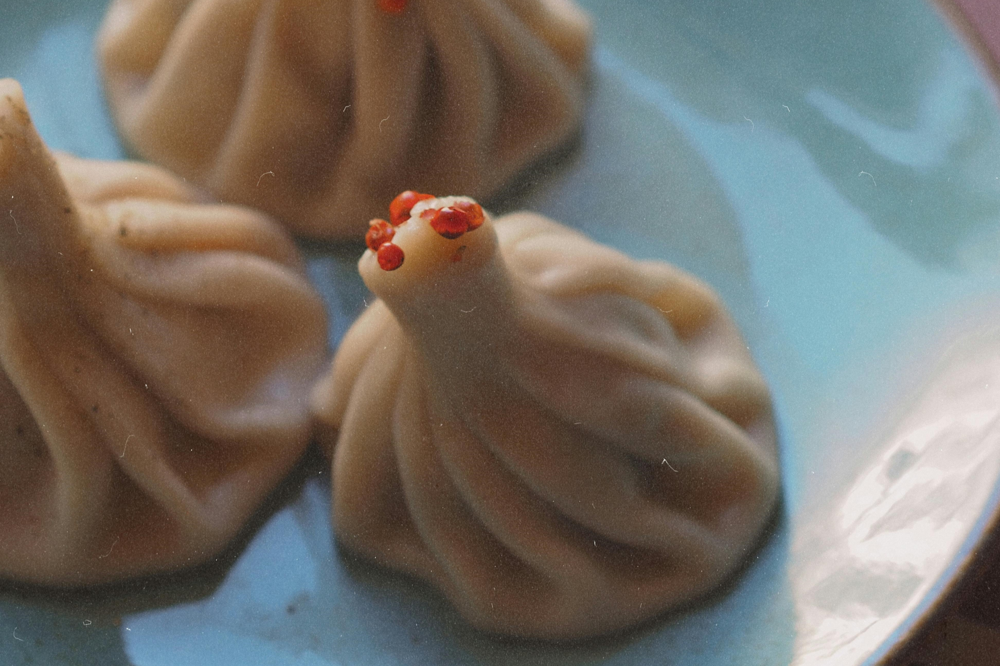
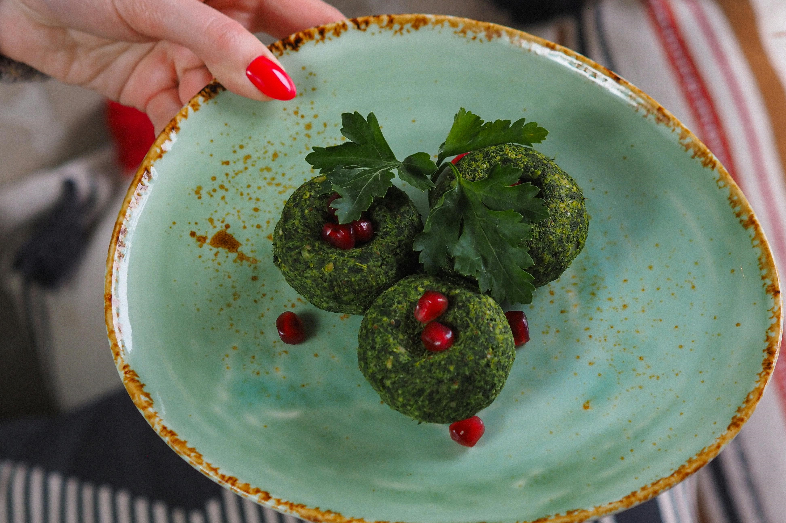

# A Food Lover’s Guide to Tbilisi: Traditional Georgian Cuisine

Tbilisi is a culinary paradise, offering a delightful blend of traditional Georgian flavors and modern gastronomic trends. Here's a guide to some of the best Georgian dishes and where you can find them in Tbilisi.

::: details Table of Contents
[[toc]]
:::
## Khachapuri

Khachapuri is a must-try dish when in Georgia. This cheese-filled bread comes in various forms, with the Adjaruli khachapuri (boat-shaped with an egg on top) being one of the most popular.

**Where to Find It:**

- **Machakhela:** Known for its diverse menu and delicious khachapuri, this restaurant is a favorite among locals and tourists alike. Try their Adjaruli khachapuri for a rich, cheesy delight.
- **Retro:** Located in the Vake district, Retro offers an authentic Adjaruli khachapuri that’s often considered one of the best in Tbilisi.

## Khinkali

Khinkali, the Georgian dumpling, is another iconic dish. Typically filled with spiced meat, these dumplings are juicy and flavorful.

**Where to Find It:**

- **Zakhar Zakharich:** Located near the Dry Bridge, this restaurant is famous for its khinkali. The meat-filled dumplings here are particularly popular.
- **Khinkali House on Rustaveli:** This central location offers a variety of khinkali fillings, from traditional meat to cheese and mushrooms.

## Pkhali

Pkhali is a traditional Georgian appetizer made from minced vegetables, herbs, and walnuts. It’s healthy, flavorful, and comes in a variety of forms.

**Where to Find It:**

- **Cafe Littera:** Located in a beautiful old building, this restaurant offers a sophisticated take on traditional Georgian dishes, including excellent pkhali.
- **Shavi Lomi:** Known for its creative approach to Georgian cuisine, Shavi Lomi serves delicious pkhali in a cozy, artistic setting.

## Churchkhela

Churchkhela is a popular Georgian snack made from grape must, nuts, and flour. It’s often referred to as "Georgian Snickers."

**Where to Find It:**

- **Deserter's Bazaar:** This bustling market is a great place to find fresh and authentic churchkhela. The vendors here offer a wide variety of flavors and types.
- **Dry Bridge Market:** Another excellent spot to pick up churchkhela, this market is also a treasure trove of antiques and unique souvenirs.

## Final Thoughts

Tbilisi offers a rich culinary landscape that’s sure to delight any food lover. From hearty khachapuri to delicate pkhali, the city’s cuisine reflects its rich cultural heritage. Be sure to explore these dishes and the recommended spots to get a true taste of Georgia.

&nbsp;

-----
&nbsp;

<!--@include: @/services-block.md-->