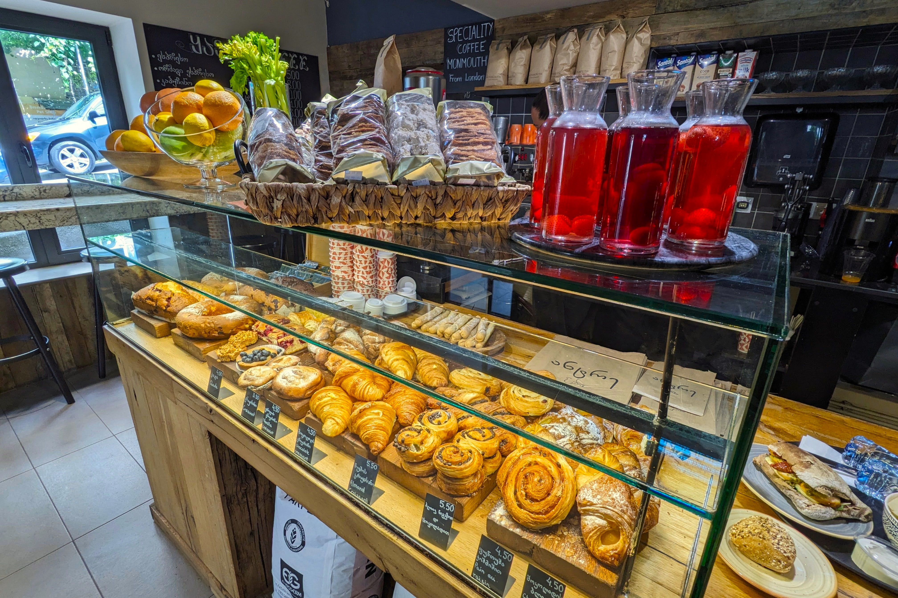

# Discover Tbilisi in Two Days: An Immersive Itinerary

Tbilisi, Georgia's vibrant capital, is a city that seamlessly blends old-world charm with modern flair. Whether you’re a history buff, a foodie, or a casual traveler, Tbilisi has something for everyone. Here's a detailed two-day itinerary to help you experience the best this captivating city has to offer.

::: details Table of Contents
[[toc]]
:::
## Day 1: Exploring the Heart of Tbilisi

### Morning: Old Town and Historic Sights

**9:00 AM - Breakfast at Stamba Café**

Start your day with a hearty breakfast at Stamba Café. This trendy spot, located in a repurposed Soviet-era printing house, offers a diverse menu with delicious options ranging from traditional Georgian dishes to international favorites. The chic ambiance and excellent coffee will set the tone for your day.

**10:00 AM - Stroll through the Old Town**

After breakfast, make your way to Tbilisi’s Old Town, a picturesque area with winding cobblestone streets and colorful houses. Begin at **Freedom Square**, where the impressive statue of St. George stands as a symbol of the city’s resilience. From there, wander through the narrow alleys, discovering hidden courtyards and charming balconies.

**11:00 AM - Visit the Anchiskhati Basilica**

Head towards the Anchiskhati Basilica, the oldest surviving church in Tbilisi, dating back to the 6th century. The basilica’s modest exterior belies its historical significance, and the serene interior offers a moment of tranquility.

**12:00 PM - Explore Sioni Cathedral**

Next, visit the nearby Sioni Cathedral, an architectural gem with beautiful frescoes and a rich history. The cathedral is dedicated to the Assumption of the Virgin Mary and has been an important religious site since the 6th century.

### Afternoon: Culture and Cuisine

**1:00 PM - Lunch at Samikitno**

For lunch, head to Samikitno, a popular restaurant offering a wide array of traditional Georgian dishes. Try khachapuri (cheese-filled bread), khinkali (dumplings), and a refreshing glass of homemade lemonade. The lively atmosphere and delicious food make it a great spot to refuel.

**2:30 PM - Narikala Fortress and Botanical Garden**

After lunch, take the cable car from Rike Park to Narikala Fortress. The fortress, dating back to the 4th century, provides stunning panoramic views of Tbilisi. Spend some time exploring the ruins and taking in the breathtaking vistas of the city below.

From the fortress, it’s a short walk to the Tbilisi Botanical Garden. Wander through the lush gardens, enjoy the peaceful atmosphere, and perhaps take a rest by the waterfall. The garden is a perfect spot to relax and escape the hustle and bustle of the city.

**4:30 PM - Sulphur Baths in Abanotubani**

No visit to Tbilisi is complete without experiencing the famous sulphur baths in the Abanotubani district. Opt for a private room at Chreli-Abano, where you can soak in the healing waters and enjoy a traditional scrub. The baths are both rejuvenating and a unique cultural experience.

### Evening: Food and Entertainment

**7:00 PM - Dinner at Shavi Lomi**

For dinner, make your way to Shavi Lomi, a stylish restaurant known for its contemporary take on Georgian cuisine. The menu features creative dishes made with fresh, local ingredients, and the cozy interior creates a welcoming atmosphere.

**9:00 PM - Nightcap at Fabrika**

End your day with a drink at Fabrika, a former Soviet sewing factory turned multi-functional space. Fabrika’s courtyard is a lively hub with bars, cafes, and art studios. Enjoy a cocktail or local craft beer while soaking in the eclectic vibe and mingling with locals and fellow travelers.

## Day 2: Art, Markets, and Modern Tbilisi

### Morning: Art and History

**9:00 AM - Breakfast at Entrée**

Start your second day with a delicious breakfast at Entrée, a popular bakery and café. Enjoy freshly baked pastries, sandwiches, and excellent coffee as you prepare for another day of exploration.

**10:00 AM - Tbilisi History Museum**

Head to the Tbilisi History Museum, located in the heart of the Old Town. The museum, housed in an old caravanserai, offers fascinating exhibits that trace the city’s history from ancient times to the present. The collection includes archaeological artifacts, photographs, and artworks, providing a comprehensive overview of Tbilisi’s rich past.

**11:30 AM - The National Gallery**

A short walk from the museum, the National Gallery is home to an impressive collection of Georgian art. The gallery features works by famous Georgian painters like Niko Pirosmani and Lado Gudiashvili, offering insight into the country’s artistic heritage.

<a href="https://commons.wikimedia.org/wiki/File:National_Gallery,_Rustaveli_Avenue,_Tbilisi,_Georgia.jpg">JohnDodelande_Georgie</a>, CC0, via Wikimedia Commons
### Afternoon: Markets and Modern Attractions

**1:00 PM - Lunch at Vino Underground**

For lunch, visit Vino Underground, a cozy wine bar that serves delicious small plates and an extensive selection of natural Georgian wines. The knowledgeable staff can help you choose the perfect wine to complement your meal, and the intimate setting makes for a relaxing dining experience.

**2:30 PM - Dry Bridge Market**

After lunch, head to the Dry Bridge Market, a bustling flea market where you can browse a wide array of antiques, art, and Soviet memorabilia. The market is a treasure trove for vintage lovers and those looking for unique souvenirs. Take your time exploring the stalls and chatting with the friendly vendors.

**4:00 PM - Tbilisi Mall or East Point**

For a taste of modern Tbilisi, spend your afternoon at Tbilisi Mall or East Point. These shopping centers offer a mix of international and local brands, as well as entertainment options like cinemas and arcades. Whether you’re shopping for fashion, electronics, or gifts, these malls provide a convenient and comfortable shopping experience.

### Evening: Farewell Tbilisi

**6:00 PM - Dinner at Barbarestan**

For your final dinner in Tbilisi, treat yourself to a meal at Barbarestan. This family-run restaurant is named after the legendary 19th-century Georgian cookbook author Barbare Jorjadze. The menu features traditional Georgian dishes made with seasonal ingredients and a modern twist. The warm, homey atmosphere and impeccable service make it a memorable dining experience.

**8:00 PM - Evening Stroll along Rustaveli Avenue**

After dinner, take a leisurely stroll along Rustaveli Avenue, Tbilisi’s main thoroughfare. The avenue is lined with beautiful buildings, shops, and cafes, and it’s particularly enchanting in the evening. Stop by the Rustaveli Theatre or the Georgian National Opera Theater to admire their stunning architecture.

**9:00 PM - Nightcap at Rooms Hotel**

End your Tbilisi adventure with a nightcap at Rooms Hotel, a stylish boutique hotel known for its chic design and lively bar. Enjoy a cocktail or a glass of Georgian wine in the trendy lounge, reflecting on your two-day journey through this captivating city.

Tbilisi is a city that captivates with its history, culture, and hospitality. Whether you’re wandering through ancient streets, savoring delicious food, or mingling with locals, Tbilisi offers a unique and unforgettable travel experience. This two-day itinerary is just a taste of what the city has to offer, and I hope it inspires you to discover even more of Tbilisi’s hidden gems.

&nbsp;

-----
&nbsp;

<!--@include: @/services-block.md-->