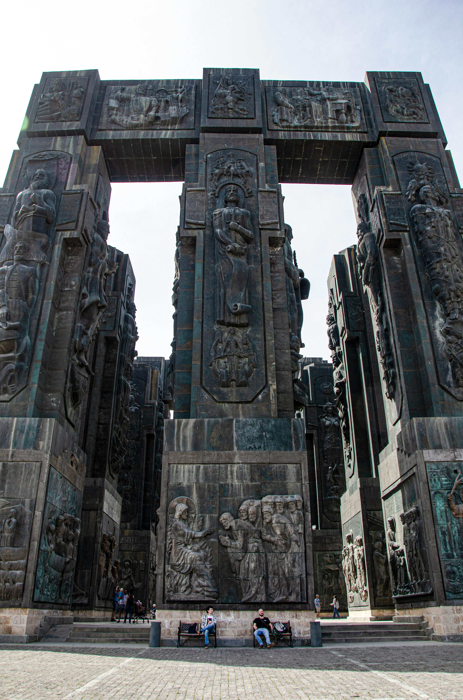
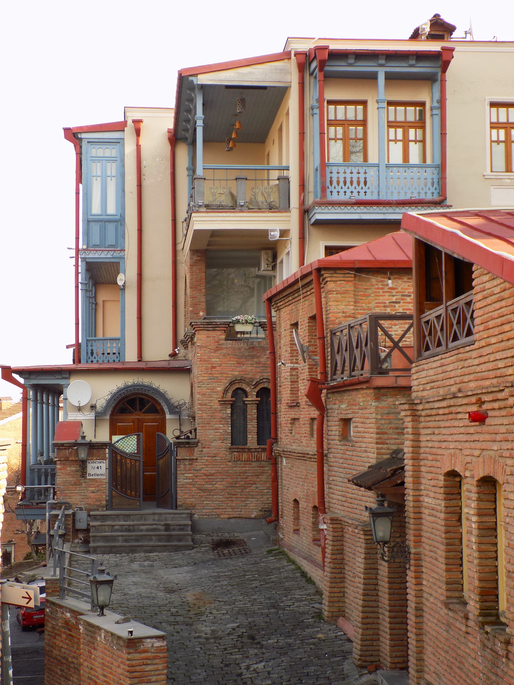
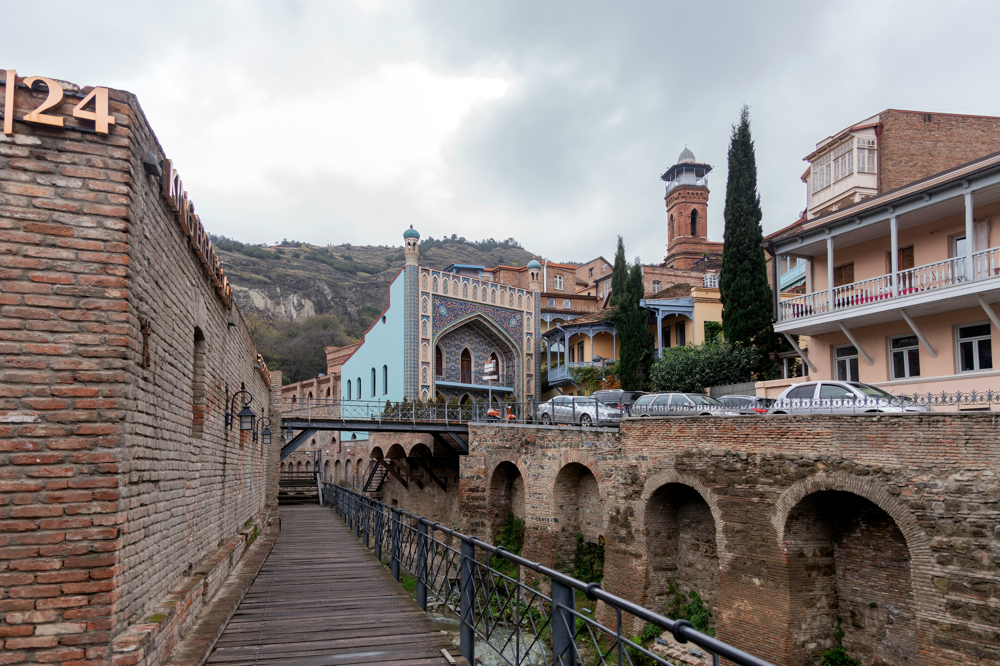

# Tbilisi’s Hidden Gems: Off-the-Beaten-Path Experiences

Tbilisi is full of well-known attractions, but it also has many hidden gems waiting to be discovered. Here are some lesser-known spots that offer a unique and memorable experience.

::: warning Table of Contents
[[toc]]
:::
## Chronicle of Georgia

Located on the outskirts of Tbilisi, the Chronicle of Georgia is a monumental sculpture that depicts the country’s history. The towering columns, adorned with carvings and statues, offer a stunning view of Tbilisi Sea and the surrounding landscape. It's a hidden gem that many tourists overlook.

## Tbilisi Open Air Museum of Ethnography

This open-air museum, located near Turtle Lake, showcases traditional Georgian houses and artifacts from different regions of the country. It’s a great place to learn about Georgia’s diverse cultural heritage while enjoying the beautiful outdoor setting.

<a href="https://commons.wikimedia.org/wiki/File:Tbilisi_Ethnographic_Museum_(DDohler_2010)-17.jpg">DDohler</a>, <a href="https://creativecommons.org/licenses/by/2.0">CC BY 2.0</a>, via Wikimedia Commons
## Betlemi Quarter

The Betlemi Quarter in the Old Town is a charming area with narrow streets, colorful houses, and hidden courtyards. It’s less touristy than other parts of the Old Town, making it a perfect spot for a leisurely stroll and discovering the local way of life.

<a href="https://commons.wikimedia.org/wiki/File:%E1%83%91%E1%83%94%E1%83%97%E1%83%9A%E1%83%94%E1%83%9B%E1%83%98%E1%83%A1_%E1%83%A5%E1%83%A3%E1%83%A9%E1%83%90_41_%E1%83%97%E1%83%91%E1%83%98%E1%83%9A%E1%83%98%E1%83%A1%E1%83%98.jpg">Lasha ge</a>, <a href="https://creativecommons.org/licenses/by-sa/4.0">CC BY-SA 4.0</a>, via Wikimedia Commons

## Sulphur Baths in Orbeliani Bathhouse

While the Abanotubani district is famous for its sulphur baths, the Orbeliani Bathhouse is a hidden gem worth visiting. Known for its beautiful blue-tiled façade, this bathhouse offers a more intimate and authentic bathing experience.

#### Rezo Gabriadze Puppet Theater and Clock Tower

The Rezo Gabriadze Puppet Theater is a quirky and delightful spot, known for its unique puppet shows and whimsical clock tower. The clock tower puts on a small show every hour, and the theater’s courtyard is a lovely place to relax with a coffee.

### Final Thoughts

Tbilisi’s hidden gems offer a glimpse into the city’s unique character and charm. These lesser-known spots provide a more intimate and authentic experience, allowing you to see a different side of Tbilisi. Be sure to explore these hidden treasures on your next visit.

&nbsp;

-----
&nbsp;

<!--@include: @/services-block.md-->