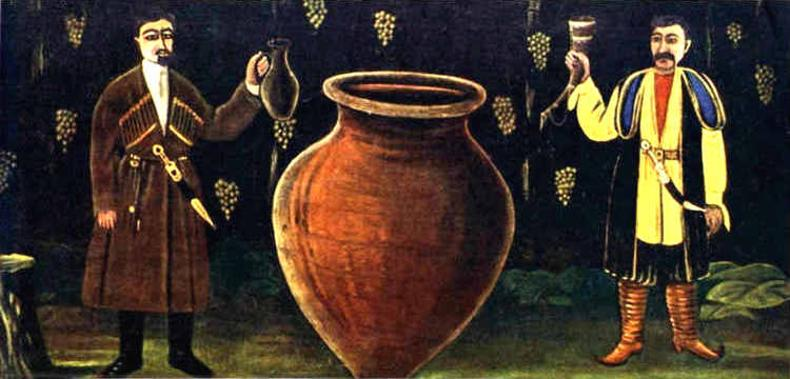

# Exploring Tbilisi’s Wine Culture: Tours and Tastings

Georgia is one of the oldest wine-producing regions in the world, and Tbilisi is the perfect place to explore this rich heritage. Here’s a guide to experiencing the best of Tbilisi’s wine culture.

::: details Table of Contents
[[toc]]
:::
## A Brief History of Georgian Wine

Wine production in Georgia dates back over 8,000 years, making it one of the oldest wine regions in the world. The country’s unique method of fermenting wine in qvevri (large clay vessels buried underground) is still used today and is recognized by UNESCO as part of the Intangible Cultural Heritage of Humanity.

## Must-Visit Wineries and Wine Bars in Tbilisi

**Pheasant's Tears:** Located in the heart of the Old Town, Pheasant's Tears offers a selection of organic wines made using traditional methods. The cozy atmosphere and knowledgeable staff make it a great place to learn about Georgian wine.

**Wine Factory No.1:** Another excellent spot for wine enthusiasts, this former wine factory houses several wine shops and restaurants, and forms an architectural monument in itself. The complex’s knowledgeable sommeliers can guide you through tastings and help you discover new favorites.

**Gvino Underground:** This wine bar focuses on natural wines from small, family-run wineries across Georgia. It’s a favorite among locals and visitors for its relaxed vibe and extensive wine list.

**8000 Vintages:** A modern wine shop and bar that offers a wide selection of Georgian wines. The staff here are passionate about wine and can provide detailed recommendations based on your preferences.

## Wine Tours and Tastings

**Tbilisi Wine Museum:** Located in the Old Town, this museum offers an in-depth look at the history of Georgian wine. Guided tours include tastings of some of the best wines in the country.

**Wine Tasting Tours:** Several companies offer wine tasting tours that take you to wineries in and around Tbilisi. These tours often include visits to vineyards, wine cellars, and tastings of various wines.

<a href="https://commons.wikimedia.org/wiki/File:%E1%83%97%E1%83%91%E1%83%98%E1%83%9A%E1%83%98%E1%83%A1%E1%83%98_-_%E1%83%A6%E1%83%95%E1%83%98%E1%83%9C%E1%83%98%E1%83%A1_%E1%83%9B%E1%83%A3%E1%83%96%E1%83%94%E1%83%A3%E1%83%9B%E1%83%98_1282.jpg">Phyrexian</a>, <a href="https://creativecommons.org/licenses/by-sa/4.0">CC BY-SA 4.0</a>, via Wikimedia Commons

## Wine Festivals and Events

**Tbilisi Wine Festival:** Held annually in May, this festival celebrates Georgia’s wine culture with tastings, music, and traditional food. It’s a great opportunity to sample a wide variety of wines and meet local winemakers.

**New Wine Festival:** This festival takes place in the spring and showcases the new vintage wines from across Georgia. It’s a lively event with plenty of tastings and a chance to learn about the latest trends in Georgian wine.

*Niko PIROSMANI (Nikolai Aslanovich Pirosmanashvili). ''Two Georgians at Marani''. Oil on oil-cloth, 107x210 cm

## Final Thoughts

Tbilisi’s wine culture is a fascinating blend of ancient traditions and modern innovations. Whether you’re a seasoned wine enthusiast or a curious newcomer, exploring the wine scene in Tbilisi is an experience not to be missed. Cheers to discovering the flavors of Georgia!

&nbsp;

-----
&nbsp;

<!--@include: @/services-block.md-->