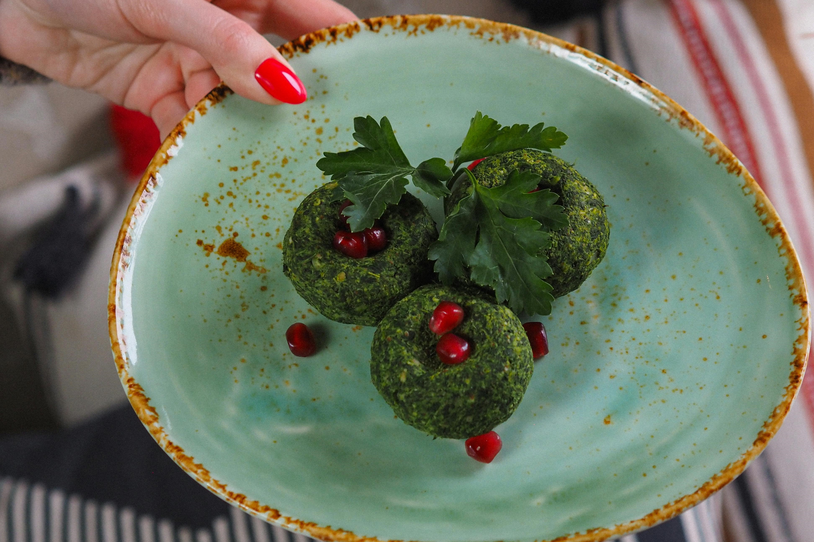

### The Best Cafes and Restaurants in Tbilisi

Tbilisi’s culinary scene is a delightful blend of traditional Georgian flavors and modern dining experiences. Here are some of the top-rated cafes and restaurants to savor during your visit.

#### What are the top-rated cafes and restaurants in Tbilisi?

Indulge in Tbilisi’s gastronomic delights at these acclaimed spots:

- **Café Littera**: Located in the Writer’s House of Georgia, offering fine dining with a focus on Georgian culinary heritage.
- **Shavi Lomi**: Known for its innovative take on traditional Georgian dishes in a cozy setting.
- **Ezo**: A charming courtyard restaurant serving authentic Georgian cuisine with a warm ambiance.
- **Lolita**: A trendy restaurant and bar with a diverse menu and vibrant atmosphere.

<a href="https://commons.wikimedia.org/wiki/File:Writer%27s_House_of_Georgia.jpg">Hundnase</a>, <a href="https://creativecommons.org/licenses/by-sa/4.0">CC BY-SA 4.0</a>, via Wikimedia Commons

#### What local dishes should I try?

Don’t miss these iconic Georgian dishes:

- **Khinkali**: Dumplings filled with spiced meat, herbs, and broth.
- **Khachapuri**: Cheese-filled bread, with regional variations like Adjarian khachapuri topped with egg.
- **Pkhali**: Vegetable dishes made from finely chopped vegetables, walnuts, and spices.

#### Are there any unique dining experiences?

Experience Tbilisi’s unique dining scenes:

- **Wine Tasting at Vino Underground**: Sample natural wines from local Georgian winemakers in a cozy wine bar setting.
- **Bakeries in Old Town**: Enjoy freshly baked bread and pastries, such as churchkhela (sweet snack made with nuts and grape juice).
- **Dining with a View**: Visit rooftop bars and restaurants offering panoramic views of Tbilisi’s skyline and historic landmarks.

## Free Tbilisi Map

Get my handy free map with all my favorite restaurants, bars, café's and coffeeshops below.

<iframe src="https://www.google.com/maps/d/embed?mid=1jp204eieW8LKV1mdtuG-ANxDnVXXTh0&ehbc=2E312F&noprof=1" width="640" height="480"></iframe>

&nbsp;

-----
&nbsp;

<!--@include: @/services-block.md-->