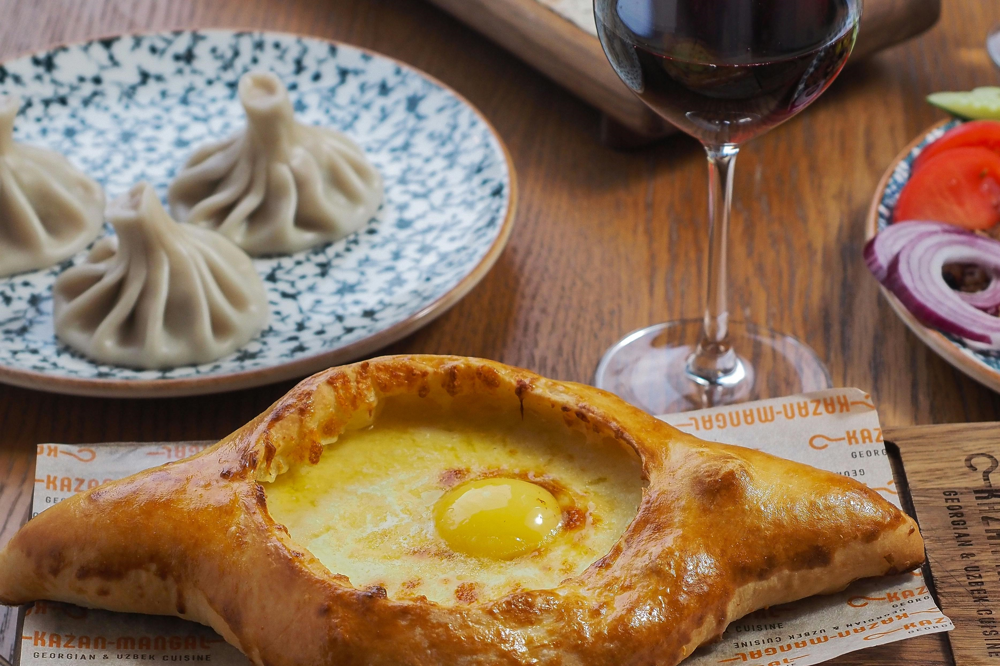
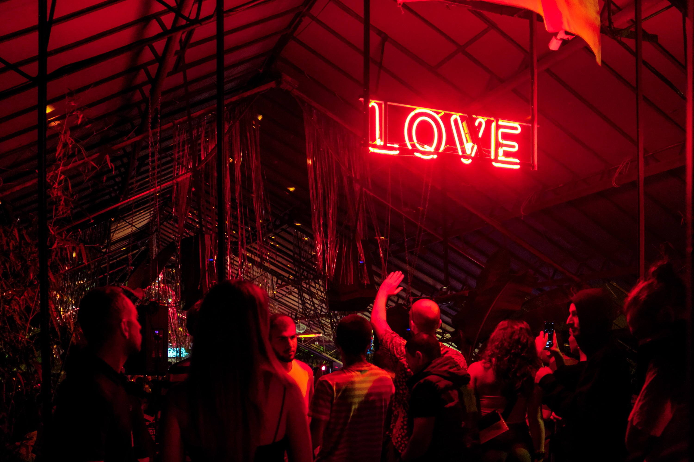

# Top Things to Do in Tbilisi

Living in Tbilisi, I spent many days wandering around, and I'm here to share my favorite things to do in this vibrant city. Whether you're a history buff, a foodie, or someone who just loves exploring new places, Tbilisi has something for everyone. Here's a guide to the top things to do in Tbilisi.

::: warning Table of Contents
[[toc]]
:::
## Explore the Old Town (Kala)

The Old Town of Tbilisi, also known as Kala, is a must-visit. The area is a labyrinth of narrow cobblestone streets, colorful houses with wooden balconies, and ancient churches.

### Highlights:

- **Narikala Fortress:** This ancient fortress offers stunning panoramic views of Tbilisi. You can either hike up or take the cable car from Rike Park.
- **Abanotubani:** The district famous for its sulphur baths. You can visit one of the bathhouses for a relaxing soak or just explore the area for its unique architecture and history.
- **Sioni Cathedral:** A beautiful cathedral with impressive frescoes and a rich history dating back to the 6th century.

## Visit the Tbilisi Opera and Ballet Theatre

The Tbilisi Opera and Ballet Theatre is an architectural gem and a hub for cultural performances. Even if you don't catch a show, the building itself is worth a visit for its stunning design.

<a href="https://commons.wikimedia.org/wiki/File:National_Opera_House._Tbilisi,_Georgia.jpg">Francisco Anzola</a>, <a href="https://creativecommons.org/licenses/by/2.0">CC BY 2.0</a>, via Wikimedia Commons

## Wander Through the Dry Bridge Market

If you love antiques and unique finds, the Dry Bridge Market is the place to be. This flea market offers everything from Soviet memorabilia to local art. It's a great place to pick up a souvenir or just enjoy the lively atmosphere.

## Take a Stroll Along Rustaveli Avenue

Rustaveli Avenue is Tbilisi's main thoroughfare, lined with impressive buildings, shops, and cafes. Key sites along the avenue include the Georgian National Museum, the Tbilisi Opera House, and the Parliament of Georgia.

<a href="https://commons.wikimedia.org/wiki/File:Rustaveli_National_Theater_in_Georgia_(Europe),_built_19th_century_in_Rococo_style.jpg">DDohler</a>, <a href="https://creativecommons.org/licenses/by/2.0">CC BY 2.0</a>, via Wikimedia Commons

## Enjoy a Wine Tasting

Georgia is known for its ancient winemaking tradition, and Tbilisi offers plenty of opportunities to sample local wines. Head to Wine Factory No. 1, a historic winery complex now hosting various restaurants and bars, for a tasting.

## Relax in Rike Park and Ride the Cable Car

Rike Park is a modern urban park with beautiful landscaping, fountains, and open spaces. From here, you can take the cable car to the Narikala Fortress for breathtaking views of the city.

## Discover Modern Art at the Tbilisi History Museum

Also known as Karvasla, the Tbilisi History Museum showcases the city's rich history and contemporary art. It's located in a historic caravanserai and offers a unique blend of past and present.

## Sample Georgian Cuisine

Tbilisi is a food lover's paradise. Don't miss trying khinkali (dumplings), khachapuri (cheese-filled bread), and pkhali (vegetable pâtés). Shavi Lomi and Café Littera are excellent places to sample traditional Georgian dishes.

## Experience Tbilisi’s Nightlife

Tbilisi has a vibrant nightlife scene, with plenty of bars, clubs, and live music venues. Bassiani, located in the basement of the Dinamo Arena, is one of the most famous nightclubs, known for its cutting-edge electronic music.

## Final Thoughts

Tbilisi is a city that beautifully balances its historical roots with modern vibrancy. Whether you're wandering through the charming streets of the Old Town, tasting local wines, or enjoying the bustling atmosphere of Rustaveli Avenue, Tbilisi offers a wealth of experiences that will leave you wanting more.

&nbsp;

-----
&nbsp;

<!--@include: @/services-block.md-->