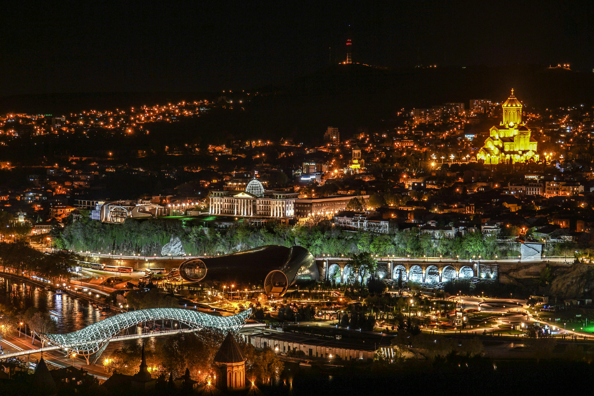
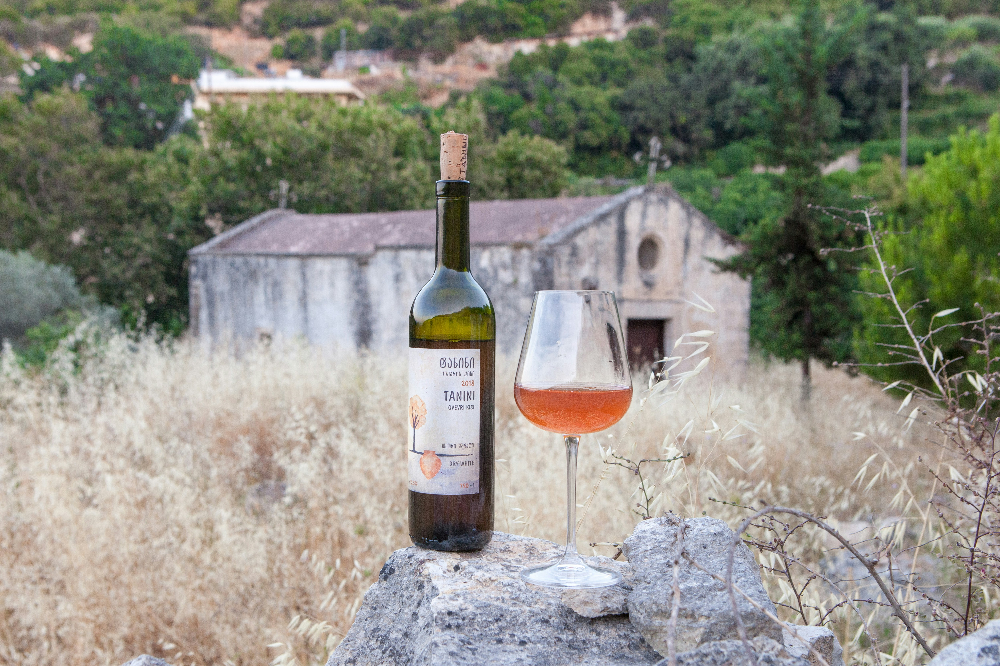
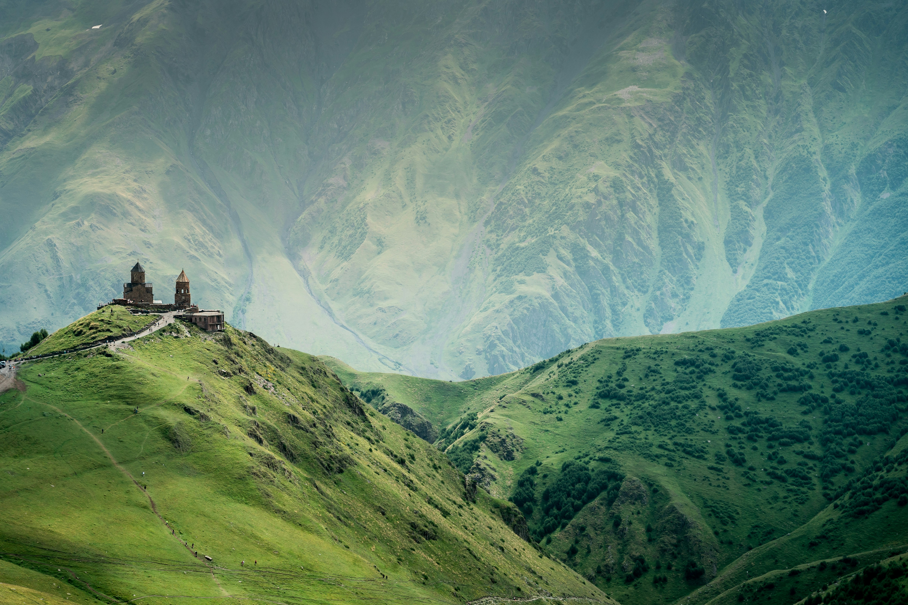

# Why Tbilisi Should Be Your Next Travel Destination

Nestled at the crossroads of Europe and Asia, Tbilisi, the vibrant capital of Georgia, is a hidden gem waiting to be discovered. For those seeking a unique travel experience rich in history, culture, and natural beauty, Tbilisi offers an unforgettable adventure. If you’ve never heard of Tbilisi or are looking for your next travel destination, let me introduce you to this captivating city and why it should be on your travel radar.

::: details Table of Contents
[[toc]]
:::
## A Fusion of History and Modernity

### A Walk Through Time

Tbilisi is a city where ancient history seamlessly blends with modern innovation. Founded in the 5th century, the city’s storied past is evident in its diverse architecture, ranging from centuries-old churches and fortresses to contemporary structures and sleek glass buildings. A stroll through Tbilisi’s Old Town (Kala) is like stepping back in time, with narrow cobblestone streets, colorful wooden balconies, and historic landmarks at every turn.

**Highlights:**
- **Narikala Fortress:** Perched on a hill overlooking the city, this ancient fortress dates back to the 4th century. It offers panoramic views of Tbilisi and is a testament to the city’s resilient spirit.
- **Sioni Cathedral:** This beautiful cathedral, with its impressive frescoes, dates back to the 6th century and is a cornerstone of Tbilisi’s religious history.
- **Abanotubani:** Famous for its sulphur baths, this district is a unique blend of architecture and relaxation. Experience a traditional sulphur bath and immerse yourself in a centuries-old Georgian tradition.

### Embracing the New

While Tbilisi’s historical charm is undeniable, the city is also a hub of modern creativity and innovation. The contemporary architecture, vibrant art scene, and bustling nightlife showcase Tbilisi’s dynamic and forward-thinking spirit.

**Highlights:**
- **The Bridge of Peace:** This striking pedestrian bridge, with its innovative design and glass structure, symbolizes the connection between Tbilisi’s historic and modern parts.
- **Fabrika:** A repurposed Soviet-era sewing factory, Fabrika is now a multi-functional space that includes a hostel, bars, cafes, and art studios. It’s a perfect example of Tbilisi’s creative transformation.

## Culinary Delights

### A Food Lover’s Paradise

Tbilisi is a haven for food enthusiasts, offering a culinary journey that reflects Georgia’s rich agricultural heritage and diverse cultural influences. Georgian cuisine is characterized by its bold flavors, fresh ingredients, and a variety of dishes that cater to every palate.

**Must-Try Dishes:**
- **Khachapuri:** This cheese-filled bread is a staple of Georgian cuisine and comes in various regional styles. The Adjaruli khachapuri, with its boat-shaped dough and runny egg, is a crowd favorite.
- **Khinkali:** Georgian dumplings filled with meat, herbs, and spices. Eating them is an art in itself, as you savor the delicious broth inside before devouring the rest.
- **Pkhali:** A variety of vegetable pâtés made from spinach, beetroot, or eggplant, typically mixed with walnuts and herbs.

### Wine Culture

Georgia is one of the oldest wine-producing regions in the world, with a winemaking tradition that dates back over 8,000 years. Tbilisi offers numerous opportunities to taste and learn about Georgian wine, with its unique varieties and ancient methods.

**Wine Experiences:**
- **Wine Factory No. 1:** A historic winery complex that now hosts various restaurants and bars, offering wine tastings and insights into Georgia’s winemaking history.
- **Wine Bars:** Explore the city’s many wine bars, such as Vino Underground and g.Vino, where you can sample a wide range of natural Georgian wines.

## Warm Hospitality

### The Heart of Georgian Culture

Georgians are renowned for their hospitality, and Tbilisi is no exception. Visitors are often struck by the genuine warmth and friendliness of the locals. Whether you’re invited to a traditional supra (feast) or simply receive a warm greeting on the street, the hospitality in Tbilisi makes every traveler feel at home.

**Cultural Encounters:**
- **Supras:** If you’re lucky enough to be invited to a supra, don’t miss it. These traditional feasts are a cornerstone of Georgian culture, filled with food, wine, toasts, and lively conversation.
- **Local Interactions:** Engage with locals in markets, cafes, and shops. Their stories and insights will enrich your understanding of Georgian culture and make your trip even more memorable.

## Natural Beauty

### A City Surrounded by Nature

Tbilisi’s natural beauty is another compelling reason to visit. The city is nestled in a valley, surrounded by hills and the picturesque Mtatsminda Mountain. This stunning backdrop provides ample opportunities for outdoor activities and scenic views.

**Natural Attractions:**
- **Mtatsminda Park:** Take the funicular to this park located on Mtatsminda Mountain. Enjoy the rides, scenic walks, and breathtaking views of the city below.
- **Tbilisi Botanical Garden:** A lush oasis in the heart of the city, the botanical garden is perfect for a peaceful stroll and a break from urban life.

### Day Trips to Explore More

Tbilisi’s central location makes it an ideal base for exploring the surrounding regions of Georgia. From the wine region of Kakheti to the mountainous landscapes of Kazbegi, day trips from Tbilisi offer a diverse range of experiences.

**Recommended Day Trips:**
- **Kakheti:** Discover Georgia’s wine country, with its vineyards, charming villages, and historic monasteries.
- **Kazbegi:** Experience the dramatic mountain scenery and visit the iconic Gergeti Trinity Church, perched high above the town of Stepantsminda.

## Vibrant Nightlife and Arts Scene

### Nightlife

Tbilisi’s nightlife is vibrant and diverse, offering something for every taste. From sophisticated cocktail bars to pulsating nightclubs, the city comes alive after dark.

**Nightlife Hotspots:**
- **Bassiani:** One of the most famous nightclubs in Tbilisi, located in the basement of the Dinamo Arena, Bassiani is known for its cutting-edge electronic music and dynamic atmosphere.
- **Dive Bar:** For a more laid-back experience, visit Dive Bar, a cozy spot with a great selection of local beers and live music.

### Arts and Culture

Tbilisi’s arts scene is flourishing, with numerous galleries, theaters, and cultural events. The city’s creative spirit is palpable, and there are plenty of opportunities to immerse yourself in its artistic offerings.

**Cultural Highlights:**
- **Tbilisi Opera and Ballet Theatre:** A stunning architectural gem and a hub for cultural performances. Even if you don’t catch a show, the building itself is worth a visit.
- **Modern Art Museum:** Explore the works of contemporary Georgian artists and gain insight into the country’s modern cultural landscape.

## Conclusion

Tbilisi is a city that beautifully balances its rich history with modern vibrancy. Whether you’re exploring ancient streets, savoring delicious food, enjoying the bustling nightlife, or soaking in the stunning views, Tbilisi offers a wealth of experiences that will leave you wanting more. For those seeking an off-the-beaten-path destination with charm, warmth, and endless discovery, Tbilisi is the perfect choice. Make Tbilisi your next travel destination and embark on an adventure that promises to captivate and inspire.

&nbsp;

-----
&nbsp;

<!--@include: @/services-block.md-->