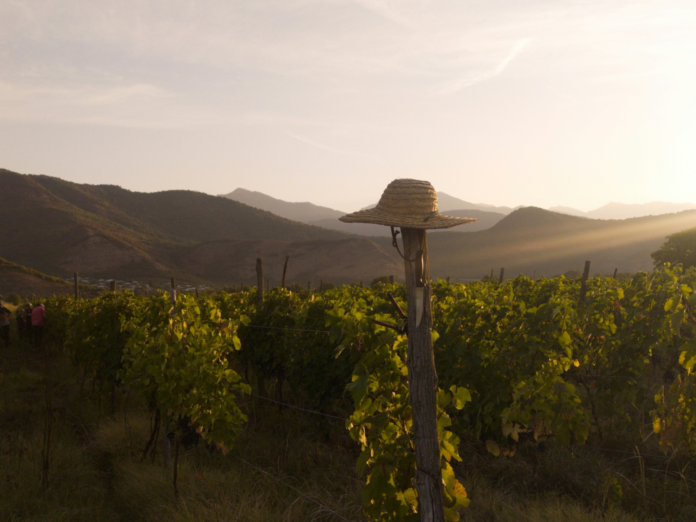

# Discover Georgia: Why Your Next Travel Destination Should Be This Hidden Gem

Nestled between Europe and Asia, the country of Georgia remains an uncharted wonder for many travelers. While it's often overshadowed by more popular destinations, Georgia offers a unique blend of stunning landscapes, rich history, vibrant culture, and unparalleled hospitality. If you're looking for an off-the-beaten-path adventure, Georgia should be at the top of your list. Here's why.

::: details Table of Contents
[[toc]]
:::
## A Tapestry of Breathtaking Landscapes

Georgia’s diverse landscapes will leave you in awe. From the majestic peaks of the Caucasus Mountains to the lush vineyards of Kakheti, the scenic beauty is truly unparalleled. Imagine hiking through verdant valleys, discovering hidden lakes, and skiing down pristine slopes. The country’s varied topography means that within a few hours, you can travel from snow-capped mountains to sunny Black Sea beaches.

## A Rich History Steeped in Legend

With a history spanning over 3,000 years, Georgia is a land of ancient civilizations and timeless traditions. Wander through the cobblestone streets of Tbilisi, where old meets new in a blend of historic buildings and modern architecture. Explore the cave cities of Uplistsikhe and Vardzia, marveling at the ingenuity of ancient builders. Each corner of Georgia tells a story, from medieval fortresses to ancient monasteries perched on mountain tops.

## Culinary Delights That Tell a Story

Georgian cuisine is a feast for the senses. The country’s unique culinary traditions have been shaped by its diverse history and geography. Savor the flavors of khachapuri (cheese-filled bread), taste the intricate spices of khinkali (dumplings), and indulge in the rich variety of local cheeses and wines. Georgian feasts, or supras, are legendary, bringing together friends and family for hours of eating, toasting, and storytelling.

## A Cradle of Wine Culture

Georgia is often referred to as the birthplace of wine, with winemaking traditions dating back over 8,000 years. The Kakheti region is the heart of Georgia’s wine country, where you can visit family-run wineries and taste wines made using ancient methods. The qvevri winemaking process, involving clay pots buried underground, produces distinctive and delicious wines. Whether you’re a wine connoisseur or just enjoy a good glass, Georgia’s wine culture is a must-experience.

## Warmth and Hospitality Like No Other

Georgians are known for their hospitality, a trait deeply ingrained in their culture. Guests are considered blessings, and you’ll be welcomed with open arms and a generous spirit. From the bustling streets of Tbilisi to the remote mountain villages, you’ll find locals eager to share their stories, traditions, and a glass of chacha (Georgian brandy). This warmth and friendliness make every visitor feel like a part of the Georgian family.

## Adventure Awaits at Every Turn

For the adventurous at heart, Georgia offers a myriad of activities. Trekking in the Caucasus Mountains provides some of the most spectacular views and challenging hikes. Ski resorts like Gudauri offer world-class slopes without the crowds. The rivers and canyons are perfect for rafting and exploring, while the coastline invites you to relax and soak up the sun. Whatever your thrill, Georgia has something to offer.

## Cultural Festivals and Events

Georgia’s calendar is filled with vibrant festivals and cultural events that showcase its rich heritage. From the Tbilisi International Film Festival to the colorful Tbilisoba harvest festival, there’s always something to celebrate. These events offer a glimpse into the country’s soul, with music, dance, art, and culinary delights taking center stage.

## Practical Tips for First-Time Visitors

- **Best Time to Visit:** Georgia is a year-round destination, but the best times to visit are spring (April to June) and autumn (September to November) when the weather is pleasant and the landscapes are at their most beautiful.
- **Getting Around:** Public transportation is available, but renting a car or hiring a private driver can make exploring more convenient, especially in remote areas.
- **Language:** While Georgian is the official language, many people in urban areas speak English, especially the younger generation.
- **Currency:** The Georgian Lari (GEL) is the local currency. Credit cards are widely accepted, but it's good to have cash for smaller establishments and remote areas.
- **Safety:** Georgia is generally safe for travelers, with low crime rates and friendly locals. As with any travel, exercise common sense and be aware of your surroundings.

## In Conclusion

Georgia is a destination that promises discovery, adventure, and a deep connection with a culture that values hospitality above all. Whether you’re drawn by its stunning landscapes, rich history, delicious cuisine, or the warmth of its people, a journey to Georgia is sure to be unforgettable. So, pack your bags and set out to explore this hidden gem – you’ll be amazed at what you find.

&nbsp;

-----
&nbsp;

<!--@include: @/services-block.md-->