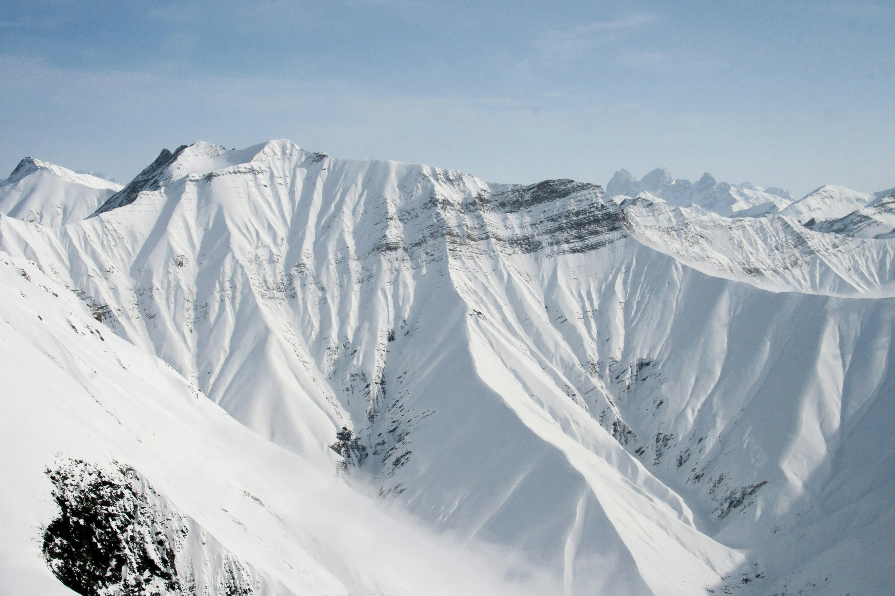

# Winter Sports in Georgia: A Snow Lover’s Paradise

If you’re a winter sports enthusiast looking for your next adventure, Georgia is the ultimate destination. Nestled in the heart of the Caucasus Mountains, Georgia offers a variety of winter activities that cater to all levels of expertise. From skiing and snowboarding to heli-skiing and ice climbing, Georgia’s winter sports scene is vibrant, thrilling, and refreshingly uncrowded. Let’s explore some of the top spots and activities that make Georgia a must-visit for winter sports aficionados.

::: warning Table of Contents
[[toc]]
:::
## Gudauri: The Crown Jewel of Georgian Ski Resorts

Gudauri, located just a two-hour drive from Tbilisi, is the most famous ski resort in Georgia. With its high-altitude slopes and expansive ski terrain, Gudauri offers something for everyone. The resort boasts modern infrastructure, including ski lifts that can take you up to 3,276 meters. Gudauri is perfect for both beginners and advanced skiers, with gentle slopes for novices and off-piste opportunities for seasoned pros. The resort is also renowned for its freeriding and heli-skiing options, offering untouched powder and breathtaking views of the Caucasus range.

## Bakuriani: A Family-Friendly Winter Wonderland

Bakuriani, situated in the Lesser Caucasus, is a fantastic destination for families and those new to winter sports. This charming resort town is known for its gentle slopes, making it an ideal spot for children and beginners. Bakuriani has a range of ski schools and rental shops, ensuring that you have everything you need for a great day on the slopes. Apart from skiing and snowboarding, Bakuriani offers activities such as snowmobiling, tobogganing, and horse-drawn sleigh rides, providing fun for the whole family.

## Mestia: An Authentic Alpine Experience

For those seeking a more rustic and authentic experience, Mestia in the Svaneti region is the place to go. This remote mountain town offers some of the most dramatic landscapes in Georgia, with its medieval stone towers and snow-capped peaks. The Hatsvali and Tetnuldi ski resorts in Mestia provide excellent skiing and snowboarding opportunities with fewer crowds. The challenging terrain and stunning vistas make it a favorite among adventure seekers. Plus, the cultural richness of Svaneti, with its unique traditions and architecture, adds a special touch to your winter getaway.

## Heli-Skiing: The Ultimate Adrenaline Rush

Georgia is gaining a reputation as a premier destination for heli-skiing, and it’s easy to see why. With vast, untouched mountain ranges and deep powder, heli-skiing in Georgia promises an exhilarating experience. Companies like Heliski Caucasus offer tailored packages that include helicopter drops on some of the highest and most remote peaks in the Caucasus. This is an adventure for experienced skiers looking to push their limits and enjoy the pristine beauty of Georgia’s wilderness.

## Ice Climbing: Scaling Frozen Giants

For those who prefer vertical adventures, Georgia’s ice climbing opportunities are not to be missed. The country’s numerous frozen waterfalls and icefalls provide a playground for climbers. Areas such as Juta and Kazbegi are popular for ice climbing, offering routes that cater to both beginners and advanced climbers. The combination of challenging climbs and spectacular alpine scenery makes ice climbing in Georgia an unforgettable experience.

## Practical Tips for Your Winter Adventure

When planning your winter sports trip to Georgia, it’s essential to consider a few practical tips. The best time to visit for winter sports is from December to April, with peak conditions typically in January and February. Make sure to book your accommodation and ski passes in advance, especially during the high season. While Georgian resorts are well-equipped, bringing your own gear can ensure a better fit and performance. Lastly, take time to explore Georgian hospitality—warm up with traditional dishes like khachapuri and sip on local wine after a day on the slopes.

Georgia’s diverse and dynamic winter sports scene is waiting to be discovered. Whether you’re carving down the slopes of Gudauri, enjoying a family day in Bakuriani, exploring the alpine beauty of Mestia, or seeking the thrill of heli-skiing and ice climbing, Georgia has something for every winter sports enthusiast. So pack your gear, embrace the adventure, and experience the snowy wonders of Georgia.

&nbsp;

-----
&nbsp;

<!--@include: @/services-block.md-->