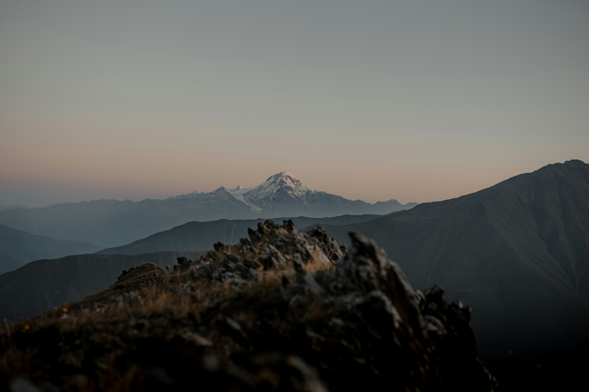

# The Wonders of Kazbegi: Georgia’s Alpine Gem

Kazbegi, located in the northern part of Georgia, is a region of awe-inspiring landscapes, majestic mountains, and rich cultural heritage. Whether you're an adventure seeker or a history buff, Kazbegi has something to offer. Here are the top things to do in Kazbegi:

::: details Table of Contents
[[toc]]
:::
## Visit the Gergeti Trinity Church

Perched at an elevation of 2,170 meters, the Gergeti Trinity Church is one of Georgia's most iconic landmarks. This 14th-century church, set against the dramatic backdrop of Mount Kazbek, offers stunning panoramic views of the surrounding mountains and valleys. The hike to the church is a rewarding experience, or you can opt for a 4x4 ride for easier access.

## Explore the Town of Stepantsminda

Stepantsminda, also known as Kazbegi, is the main hub for exploring the region. Wander through the town, visit the local markets, and learn about the area's history at the Kazbegi Museum of History and Ethnography. The town offers a range of accommodations, from guesthouses to luxury hotels, providing a comfortable base for your adventures.

## Hike to the Gveleti Waterfalls

The Gveleti Waterfalls, located a short drive from Stepantsminda, are a hidden gem worth exploring. A moderate hike through a picturesque gorge leads you to the waterfalls, where you can enjoy the sight and sound of cascading water surrounded by lush greenery. It's a perfect spot for a picnic and a refreshing dip in the clear mountain water.

## Discover the Truso Valley

The Truso Valley is a stunning area known for its colorful mineral springs, ancient towers, and serene landscapes. Hike through the valley to see the unique travertine formations and the ruins of the medieval villages. The valley is also home to the Zakagori Fortress, which offers panoramic views of the surrounding area.

## Climb Mount Kazbek

For the more adventurous, climbing Mount Kazbek is a challenging but rewarding experience. Standing at 5,033 meters, it is one of the highest peaks in the Caucasus. The climb requires proper preparation and a guide, but those who reach the summit are rewarded with unparalleled views of the Caucasus range and beyond.

## Relax at the Rooms Hotel Kazbegi

After a day of exploring, unwind at the Rooms Hotel Kazbegi, a stylish retreat that offers stunning views of Mount Kazbek. Enjoy the hotel's amenities, including a spa, indoor pool, and a restaurant serving delicious Georgian cuisine. The cozy ambiance and breathtaking scenery make it the perfect place to relax and recharge.

&nbsp;

-----
&nbsp;

<!--@include: @/services-block.md-->