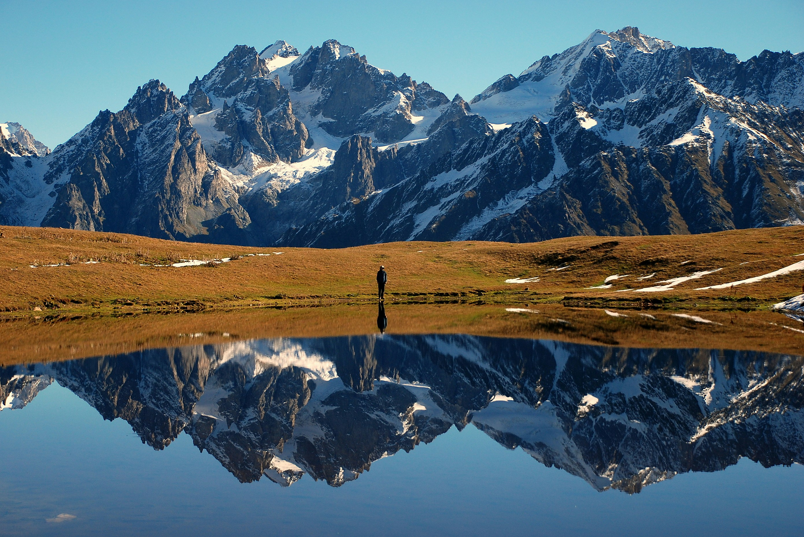
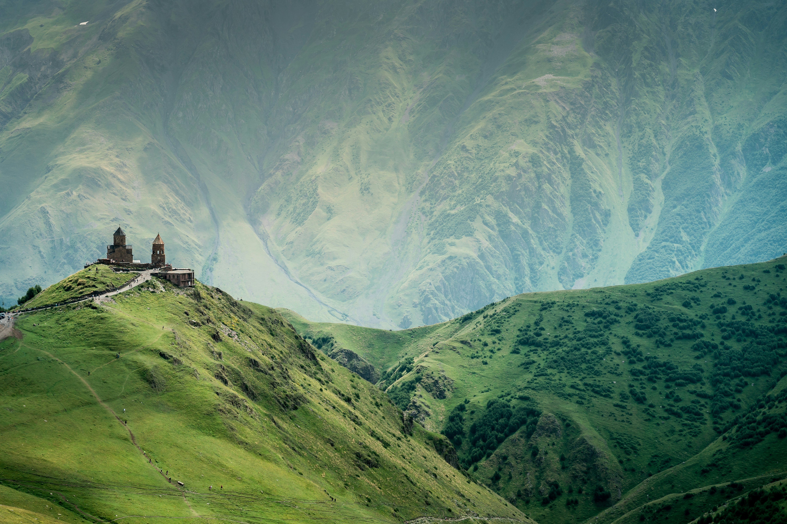
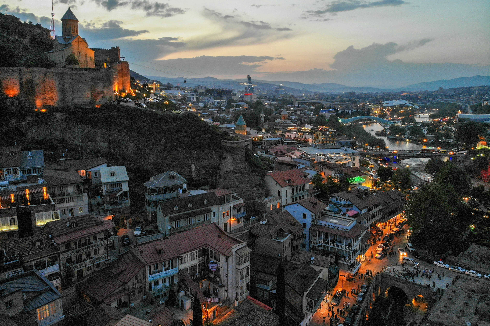

&nbsp;

----
&nbsp;
# Why Georgia?

Nestled between Europe and Asia, the country of Georgia remains an uncharted wonder for many travelers. While it's often overshadowed by more popular destinations, Georgia offers a unique blend of stunning landscapes, rich history, vibrant culture, and unparalleled hospitality. If you're looking for an off-the-beaten-path adventure, Georgia should be at the top of your list. Here's why.

[Keep reading -->](/blog/georgia/why-anyone-should-visit-georgia)

&nbsp;

&nbsp;

---
&nbsp;
# Why a Custom Georgia Tour is Perfect for You

Planning your next adventure can be overwhelming, especially when you want everything to be just right. That's where we come in. Here are the top reasons why a custom vacation to Georgia might be exactly what you need, along with a glimpse into our proven process for creating personalized itineraries.

[Keep reading -->](/our-travel-services/custom-georgia-adventures#for-who)

&nbsp;

&nbsp;

---
&nbsp;
# Packages & Pricing

We offer three distinct levels of Georgia travel planning services: Carefree, Luxury, and Groups. Each package is designed to cater to different types of travelers, ensuring a personalized and unforgettable journey through the beautiful landscapes of Georgia.

[Keep reading -->](/our-travel-services/packages-pricing)

&nbsp;

&nbsp;

---
&nbsp;
# Schedule a Free Discovery Call

Have you become excited about Georgia, but want to make sure it's the right destination for you? Schedule a free discovery call with us to ask any questions you may have, no strings attached! Or download our Georgia Travel Guide Magazine to read why Georgia is such a great destination.

[Schedule your call -->](/contact)