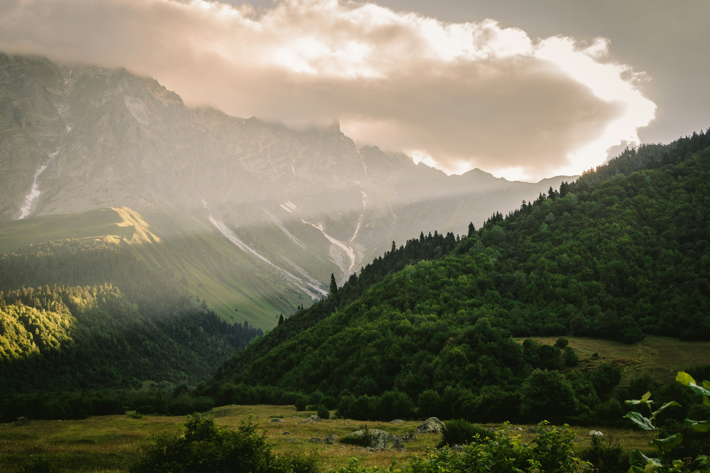
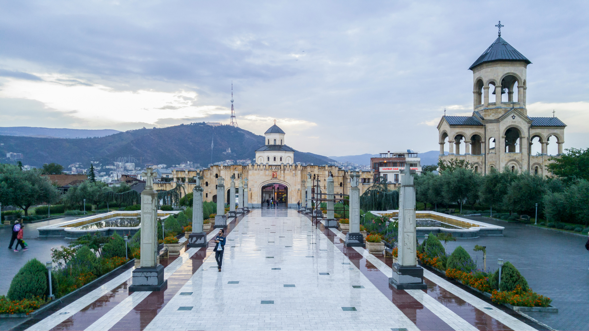

# Explore Georgia: Your Premier Travel Planning Service

You've traveled far and wide, and you understand the effort it takes to create a seamless journey tailored to your interests and pace. Our Georgia travel [planning services](/our-travel-services/packages-pricing) are here to design a personalized adventure just for you.

## Avoid the Travel Stress

It’s tempting to cram too much into your itinerary, but that can lead to a hectic vacation instead of a relaxing one. You deserve a trip where you can truly immerse yourself in each moment without feeling rushed or overwhelmed.

## Immerse Yourself in the Experience

Marvel at the intricate frescoes of the ancient monasteries. Feel the vibrant energy of Tbilisi’s bustling bazaars. Breathe in the crisp mountain air as you trek through the lush landscapes of Svaneti. Savor the flavors of authentic Georgian cuisine, from khachapuri to khinkali. Experience the warmth of Georgian hospitality as you connect with locals in a traditional supra feast.

## Leave the Details to Us

Planning a trip to Georgia can be daunting with so much information out there. Let us handle the research and details, ensuring your itinerary is both enjoyable and stress-free. We craft each day to focus on experiences that matter to you, leaving room for discovery and relaxation.

## Simplicity Is Key

Our travel planning service provides you with a clear, concise itinerary—one page per day, with all necessary contact information at your fingertips. Our goal is for you to experience Georgia fully, without the burden of constant planning. Each activity is meticulously researched and verified, presented to you in a simple, zen-like format.

## Let Us Guide You

Want to have a carefree trip and return with unforgettable stories? Our Georgia travel planning services will ensure you make the most of your trip, creating memories that will last a lifetime. Read more about why a custom Georgia tour might be perfect for you below. Or take a look at our packages and pricing [here](/our-travel-services/packages-pricing).

&nbsp;

---

&nbsp;

# 5 Reasons Why a Custom Georgia Tour is Perfect for You {#for-who}

Planning your next adventure can be overwhelming, especially when you want everything to be just right. That's where we come in. Here are the top reasons why a custom vacation to Georgia might be exactly what you need, along with a glimpse into our proven process for creating personalized itineraries.

### 1. You Prefer Unique, Individual Experiences

Standard tours aren’t for everyone. While some enjoy large group tours, small group tours, or private tours, others crave something more personalized. At Explore Georgia, we start from scratch to design a vacation tailored to your preferences. There are no templates—just your unique vision brought to life.

### 2. You Have Specific Interests in Mind

Whether it’s exploring the ancient streets of Tbilisi, hiking in the Caucasus Mountains, or diving into Georgia's rich culinary scene, we’ve got you covered. You might know what you want to see but aren’t sure about the logistics. Share your interests, budget, and time frame, and we'll craft the perfect itinerary for you.

### 3. You're Too Busy to Plan the Details

Travel planning can be time-consuming, especially with the abundance of information available online. If you have a busy schedule and can’t spend hours researching and booking, let us handle it. We’ll sift through the details and present you with a seamless travel plan.

### 4. Your Group Has Specific Needs

Traveling with kids? Have dietary restrictions? Maybe you're in a group with varied interests: some want to explore historical sites, others prefer outdoor activities, and some just want to relax. We cater to all these needs, ensuring everyone in your group has a fantastic experience.

### 5. It's Your Dream Trip and You Want It to Be Perfect

You've been dreaming about visiting Georgia, and now you want everything to be just right. You’ve seen stunning photos and read amazing stories, but aren’t sure where to start. We can help turn your dream into reality, creating a trip that you'll remember forever, without the stress of planning it yourself.