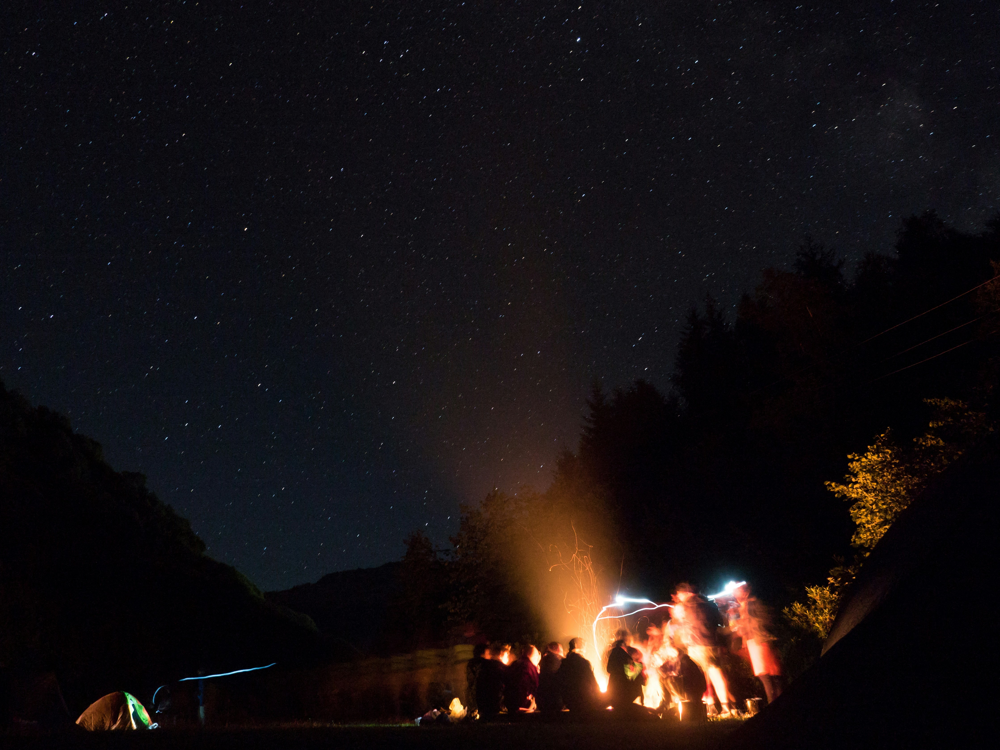

# Group Trips: Your Adventure Awaits in Georgia

Are you ready to embark on an unforgettable journey through the heart of Georgia? Our group tours are the perfect way to explore this beautiful country with a set itinerary, allowing you to join a group of like-minded travelers and enjoy the ride without any of the hassle. Unlike our custom packages, which are tailored to individual preferences, these tours bring together travelers from different places to experience Georgia's magic together. All you need to do is pack your bags and join the fun!

## What's Included

Our group tours cover everything you need for a fantastic experience in Georgia, from accommodation to activities, tours, and restaurant reservations. The only thing you’ll need to arrange yourself is your flight to Georgia, as we know everyone has their own preferred airports and flight options.

Our pricing is straightforward and offers excellent value for money:
- One-week adventure: €749 per person
- Two-week adventure: €1199 per person

When you sign up for one of our tours, you'll receive a detailed information package with all the necessary details to get you started on your adventure. 

## What’s Included in the Price:
- Accommodation
- Daily breakfast and select meals
- Guided tours and activities
- Restaurant reservations
- Transportation within Georgia
- Average group size of 10-20 people 

## What’s Not Included:
- Flights to and from Georgia
- Travel insurance
- Personal expenses
- Additional meals and drinks not included in the package

## Trip Highlights:
- Explore the ancient city of Mtskheta
- Hike through the stunning landscapes of the Caucasus Mountains
- Discover the vibrant city life of Tbilisi
- Taste traditional Georgian wines in the Kakheti region
- Relax on the Black Sea coast in Batumi
- Visit historical monasteries and UNESCO World Heritage Sites

## Important Trip Details

To join our group trips, you must be at least 18 years old. These tours are designed for travelers aged 18-35, perfect for young adventurers looking to make new friends and create lasting memories. 

Most nationalitites can enter Georgia for up to a year without a visa. Check out the full list of countries [here](https://migration.commission.ge/index.php?article_id=160&clang=1). Ensure your passport is valid for at least six months beyond your date of entry. It’s always wise to check the latest visa information with the Georgian embassy before you travel, as rules can change.

Citizens of EU member states may enter Georgia on the basis of a travel document, as well as ID card issued by a member state of the European Union indicating the name, the last name, and the date of birth of the person, and has a photograph of the person.

## Sign Up Now!

Ready to experience Georgia like never before? Sign up today to receive your information packag with more details on the itinerary. This way you can check out whether this trip would be something for you. Afterwards you can decide whether or not you would like to sign up. Don’t miss out on this opportunity to explore one of the most beautiful and culturally rich countries in the world with a group of new friends. Join us for a trip filled with fun, adventure, and unforgettable experiences.

## Discover the Benefits of Group Travel

Traveling with a group offers unique advantages that can transform your trip into an extraordinary experience. One of the greatest benefits is the social aspect—meeting a diverse group of people who share your passion for adventure can lead to lifelong friendships. You’ll have companions to share the excitement with, whether it's marveling at breathtaking landscapes or enjoying a meal together at a local restaurant. 

Group travel also provides a sense of security and ease, as all the logistics are taken care of by experienced guides. This allows you to focus on soaking up the sights and experiences without the stress of planning every detail yourself. Plus, group tours often gain access to exclusive experiences and insights from local guides that you might miss out on when traveling solo.

## Why Choose Georgia for Your Next Adventure

Georgia is a hidden gem in the travel world, offering a rich tapestry of history, culture, and natural beauty that is unmatched. This country is home to ancient cities, stunning mountain ranges, and a vibrant culinary scene that will tantalize your taste buds. From the cobblestone streets of Tbilisi, with its eclectic architecture and lively arts scene, to the serene vineyards of Kakheti where you can taste some of the world’s oldest wines, Georgia offers a diverse array of experiences. 

Adventure seekers can hike in the picturesque Caucasus Mountains, while history buffs can explore centuries-old monasteries and fortresses. The warm hospitality of the Georgian people will make you feel welcome and create a truly immersive travel experience. Choosing Georgia means discovering a land where ancient traditions meet modern vibrancy, providing a unique and unforgettable journey.